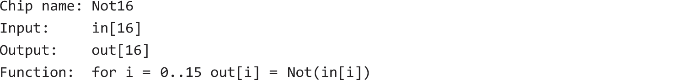
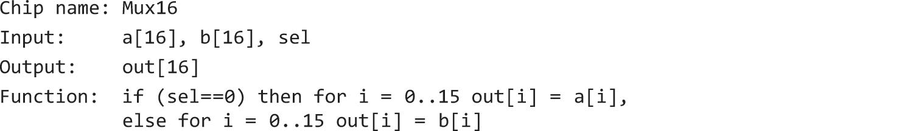
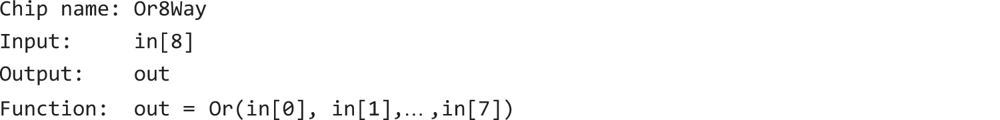
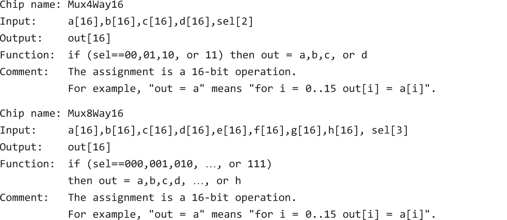
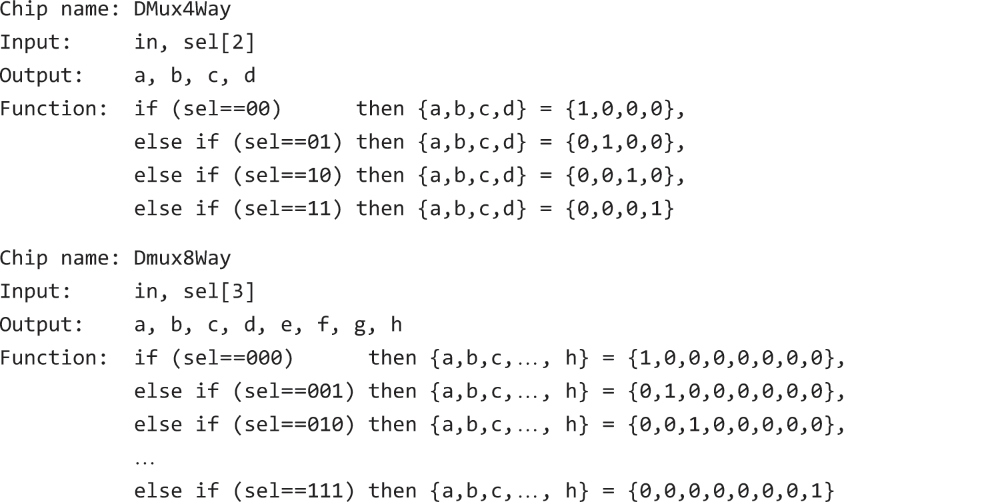

# 布尔逻辑

### 布尔函数


<br>

George Boole证明了任何布尔函数都可使用And、Or、Not表示

对于一个布尔函数，通过枚举0、1入参并记录出参，得到真值表。在出参为1的若干入参组合中，将单个组合中的各入参使用{And, Not}联结， 最后使用Or
连结各组合，就得到了该函数的布尔表达式，然后通过上图的代数性质将其简化。

如：已知res=f(x,y,z)，当{x=1,y=0,z=0}或{x=0,y=1,z=0}时，res=1，那么其布尔函数表达式为：(x&!y&!z)|(!x&y&!z)。

### Nand

Henry M. Sheffer证明了Or可被And和Not表达：!(!x&!y)，并引入了功能完备的Nand和Xor，它们都可单独表示出And和Not，那么它们也就能单独表达出任意布尔函数

其中Nand(x,y)被定义为仅当{x=1,y=1}时，结果为0，否则结果为1

Not(x)=Nand(x,x)、And(x,y)=Nand(Nand(x,y),Nand(x,y))

那么只要有足够数量的Nand电路门，就可以组装表达任意布尔逻辑的电路

## 习题

### Xor


<br>

| a b | Xor |
|-----|-----|
| 0 0 | 0   |
| 0 1 | 1   |
| 1 0 | 1   |
| 1 1 | 0   |

```text
// 布尔函数表达式
(!a & b) | (a & !b)

// HDL
Not(in=a, out=notA);
Not(in=b, out=notB);
And(a=notA, b=b, out=notAB);
And(a=a, b=notB, out=aNotB);
Or(a=notAB, b=aNotB, out=out);
```

### Mux


<br>

```text
// 布尔函数表达式
(a & !b & !sel) | (a & b & !sel) | (!a & b & sel) | (a & b & sel)
(((a&!sel) & !b) | ((a&!sel) & b)) | ((!a & (b&seal)) | (a & (b&sel))
((a&!sel) & (!b | b)) | ((b&sel) & (!a | a))
((a&!sel) & 1) | ((b&sel) & 1)
(a & !sel) | (b & sel)

// HDL
Not(in=sel, out=notSel);
And(a=a, b=notSel, out=aNotSel);
And(a=b, b=sel, out=bSel);
Or(a=aNotSel, b=bSel, out=out);
```

### DMux


<br>

```text
// 布尔函数表达式
// a
!sel & in
// b
sel & in

// HDL
// a
Not(in=sel, out=notSel);
And(a=notSel, b=in, out=a);
// b
And(a=sel, b=in, out=b);
```

### Not16



```text
// 进出按位对应
Not(in=in[0], out=out[0]);
Not(in=in[1], out=out[1]);
Not(in=in[2], out=out[2]);
Not(in=in[3], out=out[3]);
Not(in=in[4], out=out[4]);
Not(in=in[5], out=out[5]);
Not(in=in[6], out=out[6]);
Not(in=in[7], out=out[7]);
Not(in=in[8], out=out[8]);
Not(in=in[9], out=out[9]);
Not(in=in[10], out=out[10]);
Not(in=in[11], out=out[11]);
Not(in=in[12], out=out[12]);
Not(in=in[13], out=out[13]);
Not(in=in[14], out=out[14]);
Not(in=in[15], out=out[15]);
```

### And16


```text
// 进出按位对应
And(a=a[0], b=b[0], out=out[0]);
And(a=a[1], b=b[1], out=out[1]);
And(a=a[2], b=b[2], out=out[2]);
And(a=a[3], b=b[3], out=out[3]);
And(a=a[4], b=b[4], out=out[4]);
And(a=a[5], b=b[5], out=out[5]);
And(a=a[6], b=b[6], out=out[6]);
And(a=a[7], b=b[7], out=out[7]);
And(a=a[8], b=b[8], out=out[8]);
And(a=a[9], b=b[9], out=out[9]);
And(a=a[10], b=b[10], out=out[10]);
And(a=a[11], b=b[11], out=out[11]);
And(a=a[12], b=b[12], out=out[12]);
And(a=a[13], b=b[13], out=out[13]);
And(a=a[14], b=b[14], out=out[14]);
And(a=a[15], b=b[15], out=out[15]);
```

### Or16


```text
// 进出按位对应
Or(a=a[0], b=b[0], out=out[0]);
Or(a=a[1], b=b[1], out=out[1]);
Or(a=a[2], b=b[2], out=out[2]);
Or(a=a[3], b=b[3], out=out[3]);
Or(a=a[4], b=b[4], out=out[4]);
Or(a=a[5], b=b[5], out=out[5]);
Or(a=a[6], b=b[6], out=out[6]);
Or(a=a[7], b=b[7], out=out[7]);
Or(a=a[8], b=b[8], out=out[8]);
Or(a=a[9], b=b[9], out=out[9]);
Or(a=a[10], b=b[10], out=out[10]);
Or(a=a[11], b=b[11], out=out[11]);
Or(a=a[12], b=b[12], out=out[12]);
Or(a=a[13], b=b[13], out=out[13]);
Or(a=a[14], b=b[14], out=out[14]);
Or(a=a[15], b=b[15], out=out[15]);
```

### Mux16



```text
// 进出按位对应
Mux(a=a[0], b=b[0], sel=sel, out=out[0]);
Mux(a=a[1], b=b[1], sel=sel, out=out[1]);
Mux(a=a[2], b=b[2], sel=sel, out=out[2]);
Mux(a=a[3], b=b[3], sel=sel, out=out[3]);
Mux(a=a[4], b=b[4], sel=sel, out=out[4]);
Mux(a=a[5], b=b[5], sel=sel, out=out[5]);
Mux(a=a[6], b=b[6], sel=sel, out=out[6]);
Mux(a=a[7], b=b[7], sel=sel, out=out[7]);
Mux(a=a[8], b=b[8], sel=sel, out=out[8]);
Mux(a=a[9], b=b[9], sel=sel, out=out[9]);
Mux(a=a[10], b=b[10], sel=sel, out=out[10]);
Mux(a=a[11], b=b[11], sel=sel, out=out[11]);
Mux(a=a[12], b=b[12], sel=sel, out=out[12]);
Mux(a=a[13], b=b[13], sel=sel, out=out[13]);
Mux(a=a[14], b=b[14], sel=sel, out=out[14]);
Mux(a=a[15], b=b[15], sel=sel, out=out[15]);
```

### Or8Way


<br>

```text
// 将8位输入依次做Or操作
Or(a=in[0], b=in[1], out=outA);
Or(a=outA, b=in[2], out=outB);
Or(a=outB, b=in[3], out=outC);
Or(a=outC, b=in[4], out=outD);
Or(a=outD, b=in[5], out=outE);
Or(a=outE, b=in[6], out=outF);
Or(a=outF, b=in[7], out=out);
```

### 多路16位Mux


<br>

#### Mux4Way16


<br>

```text
// 先按sel[0]将四路输入分解出aOrB和cOrD两路
// 再按sel[1]从这两路中选择一路输出
Mux16(a=a, b=b, sel=sel[0], out=aOrB);
Mux16(a=c, b=d, sel=sel[0], out=cOrD);
Mux16(a=aOrB, b=cOrD, sel=sel[1], out=out);
```

#### Mux8Way16

| sel[2] | sel[1] | sel[0] | out |
|--------|--------|--------|-----|
| 0      | 0      | 0      | a   |
| 0      | 0      | 1      | b   |
| 0      | 1      | 0      | c   |
| 0      | 1      | 1      | d   |
| 1      | 0      | 0      | e   |
| 1      | 0      | 1      | f   |
| 1      | 1      | 0      | g   |
| 1      | 1      | 1      | h   |

```text
// 先按sel[0..1]将八路输入分解出abcd和efgh两路
// 再按sel[2]从这两路中选择一路输出
Mux4Way16(a=a, b=b, c=c, d=d, sel=sel[0..1], out=abcd);
Mux4Way16(a=e, b=f, c=g, d=h, sel=sel[0..1], out=efgh);
Mux16(a=abcd, b=efgh, sel=sel[2], out=out);
```

### 多路DMux


<br>

#### DMux4Way


<br>

```text
// 先按sel[1]将有效位分解到aOrB或cOrD两路
// 再按sel[0]将这两路分别再分解两路
DMux(in=in, sel=sel[1], a=aOrB, b=cOrD);
DMux(in=aOrB, sel=sel[0], a=a, b=b);
DMux(in=cOrD, sel=sel[0], a=c, b=d);
```

#### DMux8Way

| sel[2] | sel[1] | sel[0] | a  | b  | c  | d  | e  | f  | g  | h  |
|--------|--------|--------|----|----|----|----|----|----|----|----|
| 0      | 0      | 0      | in | 0  | 0  | 0  | 0  | 0  | 0  | 0  |
| 0      | 0      | 1      | 0  | in | 0  | 0  | 0  | 0  | 0  | 0  |
| 0      | 1      | 0      | 0  | 0  | in | 0  | 0  | 0  | 0  | 0  |
| 0      | 1      | 1      | 0  | 0  | 0  | in | 0  | 0  | 0  | 0  |
| 1      | 0      | 0      | 0  | 0  | 0  | 0  | in | 0  | 0  | 0  |
| 1      | 0      | 1      | 0  | 0  | 0  | 0  | 0  | in | 0  | 0  |
| 1      | 1      | 0      | 0  | 0  | 0  | 0  | 0  | 0  | in | 0  |
| 1      | 1      | 1      | 0  | 0  | 0  | 0  | 0  | 0  | 0  | in |

```text
// 先按sel[2]将有效位分解到abcd或efgh两路
// 再按sel[0..1]将这两路分别再分解四路
DMux(in=in, sel=sel[2], a=abcd, b=efgh);
DMux4Way(in=abcd, sel=sel[0..1], a=a, b=b, c=c, d=d);
DMux4Way(in=efgh, sel=sel[0..1], a=e, b=f, c=g, d=h);
```
