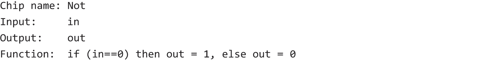
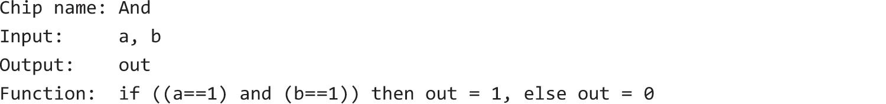

# 01.基本逻辑门

### 概述
```text
· 与非门：Nand(x, y) = Not(And(x, y))。
· 任何布尔函数都可以仅由“与、或、非”表达；根据摩根定律，“或”可由“非”和“与”表达；通过真值表可观察到“非”Not(x)可被表达为Nand(x, x)，而“与”And(x, y)可被表达为Not(Nand(x, y))。
· 所以任何布尔函数都可只通过“与非”构建，目前主流使用的“与非门”或“或非门”。
· 门是布尔函数的物理实现，只要实现了与非门，就可通过连接若干与非门来实现任何布尔函数。我们不必纠结与非门的物理实现，只需在抽象层面使用它构建布尔函数就可以了。
· 关于如何构建，先写出目的函数的真值表，找到结果为1的那些行，根据输入值为这些行分别定义一个布尔表达式，然后用或连接起来，再简化它，就得到了这个函数的布尔表达式。
```
#### 布尔代数定律，用于简化布尔表达式


### 习题

```text
out = Nand(in, in) 或 Nand(in, true)
```

```text
out = Not(Nand(a, b))
```

```text
out = Nand(Not(a), Not(b))
```

```text
out = Or(And(Not(a), b), And(a, Not(b)))
```

```text
out = Or(And(Not(sel), a), And(sel, b))
```

```text
a = And(Not(sel), in)
b = And(sel, in)
```

```text
out[0] = Not(in[0])
...
out[15] = Not(in[15])
```

```text
out[0] = And(a[0], b[0])
...
out[15] = And(a[15], b[15])
```

```text
out[0] = Or(a[0], b[0])
...
out[15] = Or(a[15], b[15])
```

```text
out[0] = Mux(a[0], b[0], sel)
...
out[15] = Mux(a[15], b[15], sel)
```

```text
out = Or(Or(Or(Or(Or(Or(Or(in[0], in[1]), in[2]), in[3]), in[4]), in[5]), in[6]), in[7])
```

```text
按sel从0向n筛选
Mux4Way16
	waitOutBySel0InAb = Mux(a, b, sel[0]);
	waitOutBySel0InCd = Mux(c, d, sel[0]);
	out = Mux(waitOutBySel0InAb, waitOutBySel0InCd, sel[1]);

Mux8Way16
	waitOutBySel0InAb = Mux(a, b, sel[0]);
	waitOutBySel0InCd = Mux(c, d, sel[0]);
	waitOutBySel0InEf = Mux(e, f, sel[0]);
	waitOutBySel0InGh = Mux(g, h, sel[0]);
	waitOutBySel1InAbcd = Mux(waitOutBySel0InAb, waitOutBySel0InCd, sel[1]);
	waitOutBySel1InEfgh = Mux(waitOutBySel0InEf, waitOutBySel0InGh, sel[1]);
	out = Mux(waitOutBySel1InAbcd, waitOutBySel1InEfgh, sel[2]);
```

```text
按sel从n向0筛选
使用HDL描述，=不是赋值，而是通路连接
DMux4Way
	DMux(in = in, a = waitOutToAb, b = waitOutToCd, sel = sel[1]);
	DMux(in = waitOutToAb, a = a, b = b, sel = sel[0]);
	DMux(in = waitOutToCd, a = c, b = d, sel = sel[0]);

DMux8Way
	DMux(in = in, a = waitOutToAbcd, b = waitOutToEfgh, sel = sel[2]);
	DMux4Way(in = waitOutToAbcd, a = a, b = b, c = c, d = d, sel = sel[0..1]);
	DMux4Way(in = waitOutToEfgh, a = e, b = f, c = g, d = h, sel = sel[0..1]);
```