# 01.布尔逻辑

### 概述
```text
布尔函数可通过下图的代数性质简化为只有{And, Or, Not}。我们通过函数描述向参数枚举0、1来得到真值表，对于结果为1的每一行，使用{And, Or, Not}联结这一行的参数们，再将这些联结通过或联结。比如res=f(x, y, z)，当{x=1, y=0, z=0}或者当{x=0, y=1, z=0}时，res=1，那么其布尔函数表达式为(x And Not(y) And Not(z)) Or (Not(x) And y And Not(z))，然后再将其通过布尔代数性质转换为简化的{And, Or, Not}组合。
```
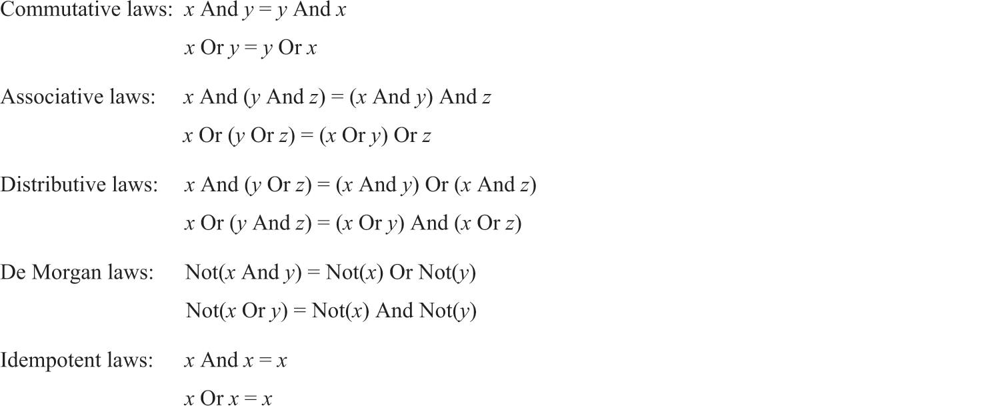
```text
根据摩根定律，Or可通过{Not, And}组成。而通过真值表，可以发现Not(x)=Nand(x, x)，And(x, y)=Not(Nand(x, y))。
```
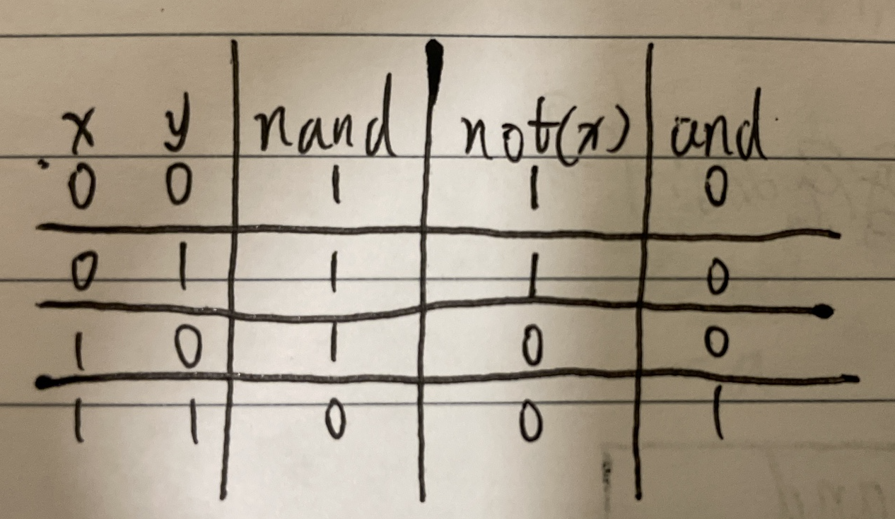
```text
所以任何布尔函数都可通过Nand组合，这种关系更像是一种发现而不是创造，没什么深刻的意义或原因。抛开Nand的物理实现，我们只要拿到足够多的物理Nand，就能组装成任何布尔函数。
```

<br>
<br>

### 习题

<hr>
<br>
<br>

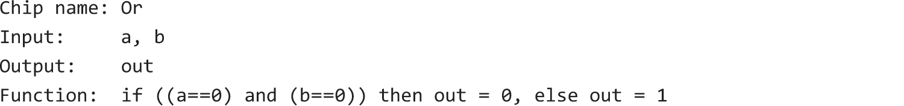
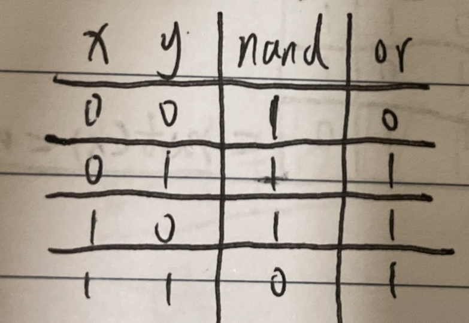
⚠️非HDL描述
```text
Nand的俩入参同时取反，可使00号和11结果互换，而中间两个结果不变，达到Or的效果。
out=Nand(Not(a), Not(b))
```

<br>
<br>
<hr>
<br>
<br>


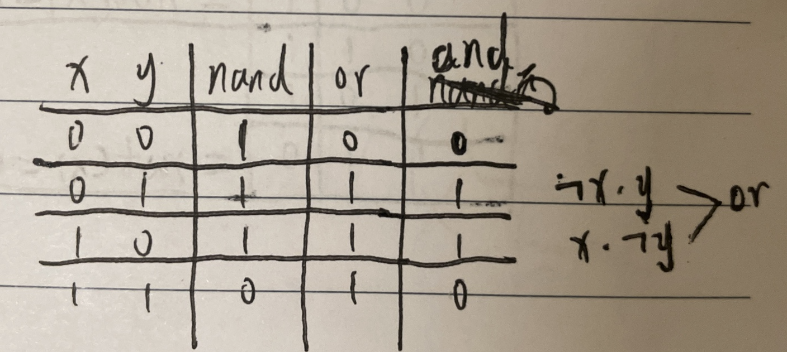
⚠️非HDL描述
```text
Nand和Or的结果作and
out=And(Nand(x, y), Or(x, y))
或者将两个结果为1的行作Or
out=Or(And(Not(a), b), And(a, Not(b)))
```

<br>
<br>
<hr>
<br>
<br>

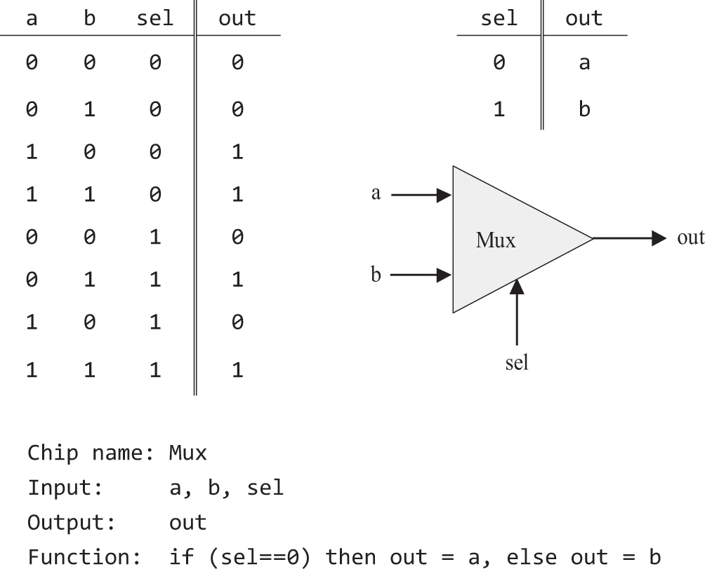
⚠️非HDL描述
```text
依照描述
out=Or(And(sel, b), And(!sel, a))
```

<br>
<br>
<hr>
<br>
<br>


⚠️非HDL描述
```text
依照描述
a=And(Not(sel), in)
b=And(sel, in)
```

<br>
<br>
<hr>
<br>
<br>

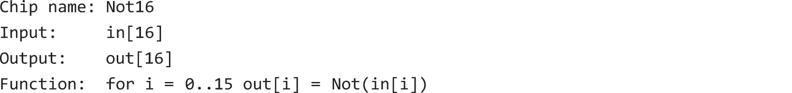
⚠️非HDL描述
```text
out[0]=Not(in[0])
...
out[15]=Not(in[15])
```

<br>
<br>
<hr>
<br>
<br>

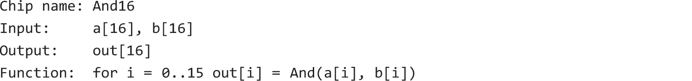
⚠️非HDL描述
```text
out[0]=And(a[0], b[0])
...
out[15]=And(a[15], b[15])
```

<br>
<br>
<hr>
<br>
<br>


⚠️非HDL描述
```text
out[0]=Or(a[0], b[0])
...
out[15]=Or(a[15], b[15])
```

<br>
<br>
<hr>
<br>
<br>

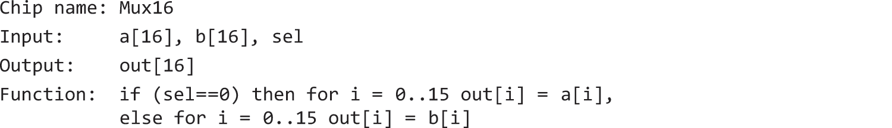
⚠️非HDL描述
```text
out[0]=Mux(a[0], b[0], sel)
...
out[15]=Mux(a[15], b[15], sel)
```

<br>
<br>
<hr>
<br>
<br>

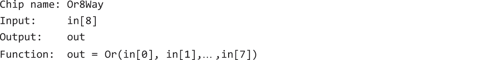
⚠️非HDL描述
```text
out=Or(Or(Or(Or(Or(Or(Or(in[0], in[1]), in[2]), in[3]), in[4]), in[5]), in[6]), in[7])
```

<br>
<br>
<hr>
<br>
<br>

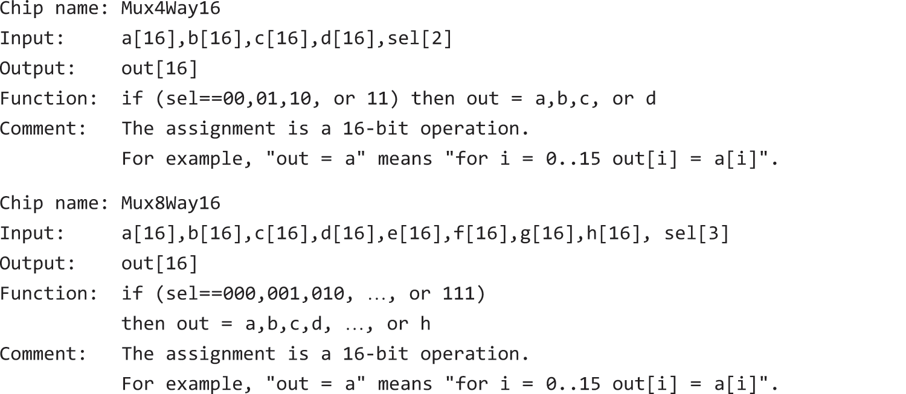
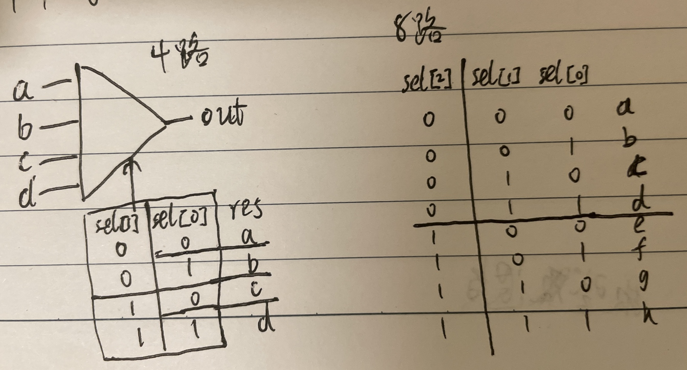
⚠️非HDL描述
```text
4路的，先按sel[0]位选择出(a|b)和(c|d)，再按sel[1]位从(a|b)和(c|d)中选择出一个。
ab=Mux16(a, b, sel[0])
cd=Mux16(c, d, sel[0])
out=Mux16(ab, cd, sel[1])
----------------------------------
8路的，先按sel[0..1]位选择出(a|b|c|d)和(e|f|g|h)，再按sel[2]位从(a|b|c|d)和(e|f|g|h)中选择出一个。
abcd=Mux4Way16(a, b, c, d, sel[0..1])
efgh=Mux4Way16(e, f, g, h, sel[0..1])
out=Mux16(abcd, efgh, sel[2])
```

<br>
<br>
<hr>
<br>
<br>

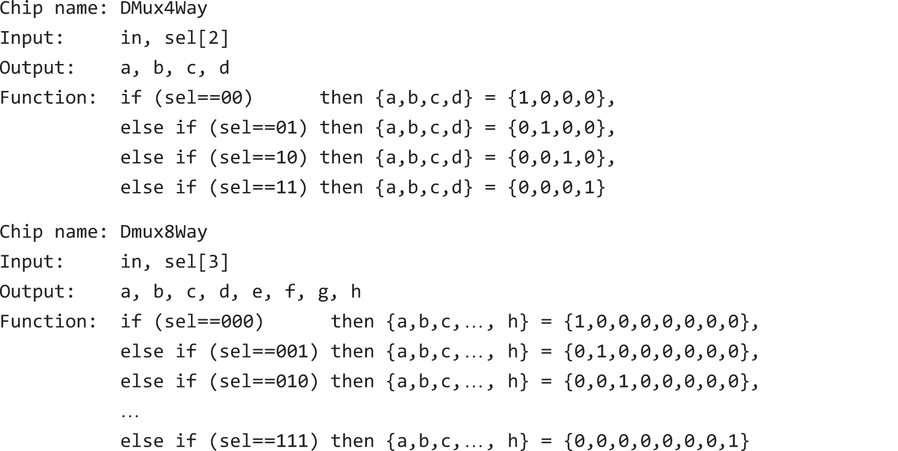
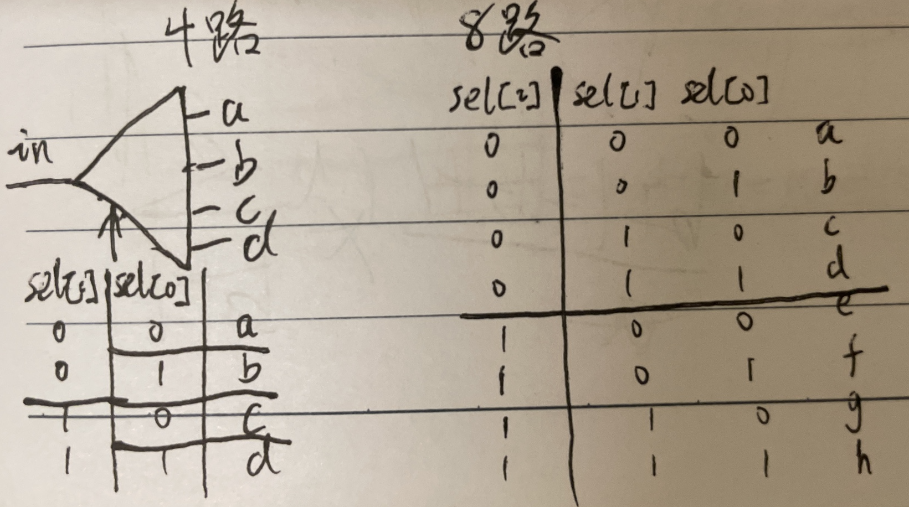
```text
4路的，先按sel[1]位选择出ab和cd两个输出管道，再按sel[0]位将ab和cd分别作为输入选择出具体的输出管道。
Dmux(in=in, sel=sel[1], a=ab, b=cd)
Dmux(in=ab, sel=sel[0], a=a, b=b)
Dmux(in=cd, sel=sel[0], a=c, b=d)
-----------------------------------
8路的，先按sel[2]位选择出abcd和efgh两个输出管道，再按sel[0..1]位将abcd和efgh分别作为输入选择出具体的输出管道。
Dmux(in=in, sel=sel[2], a=abcd, b=efgh)
Dmux4Way(in=abcd, sel=sel[0..1], a=a, b=b, c=c, d=d)
Dmux4Way(in=efgh, sel=sel[0..1], a=e, b=f, c=g, d=h)
```