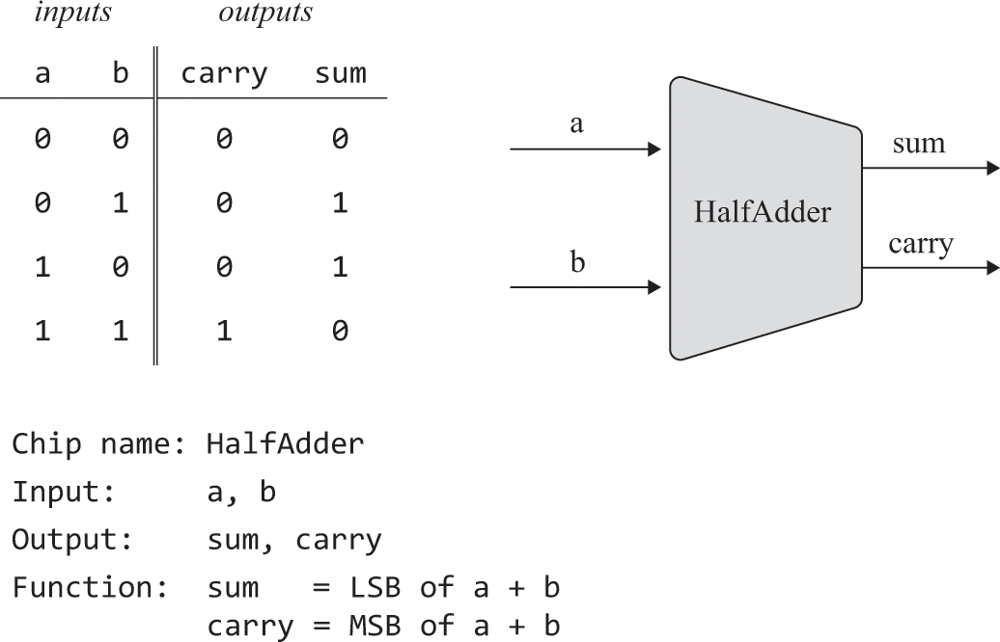
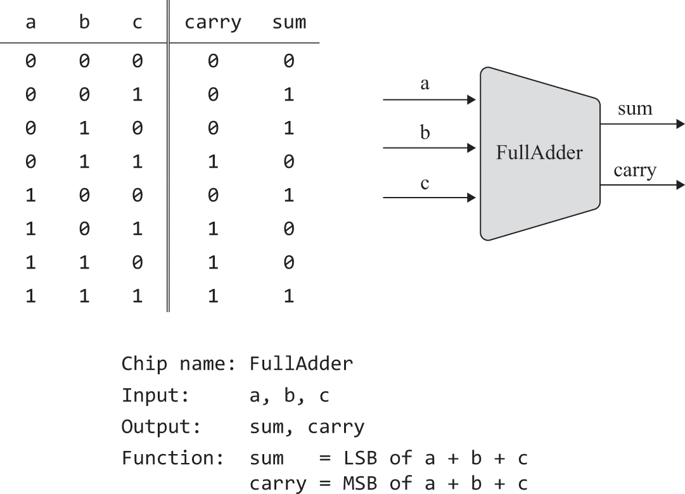
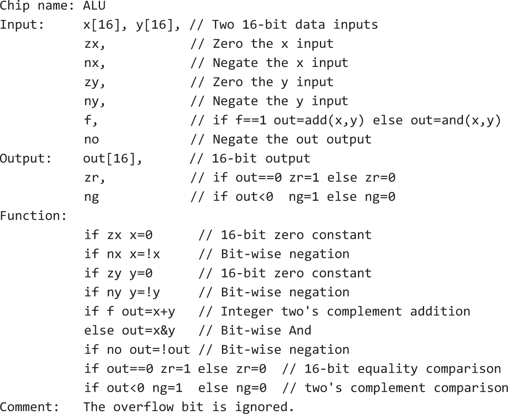
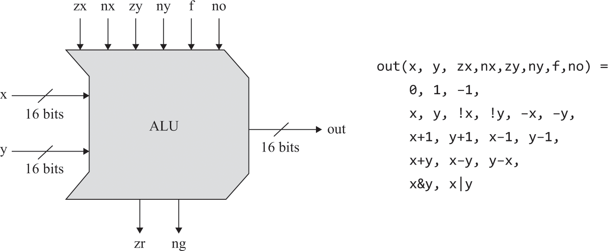

# 布尔运算

- 在若干表示符号数字的二进制编码方案中，几乎所有现代计算机都采用硬件实现不复杂的“补码”方式。特性如下：
  - 在n位二进制系统中的表示范围为：[-(2^(n-1)), (2^(n-1))-1]，-x被表示为(2^n)-x
  - 正数最高位0，负数最高位1
  - 将x取反有两种方法
    - 找到最低的有效位1，将它的更高位（不包括自身）全部反转
    - 反转所有位，然后加1
  - x-y可被x+(-y)实现
- 半加器处理两个bit位，全加器处理三个，其由半加器组成
- 对计算结果忽略溢出，从产生的结果来看。对于3位二进制系统，表示范围为-4~3，不断加1会出现如下循环： 0, 1, 2, 3, 0, -1, -2, -3, -4……

## 习题

### HalfAdder


<br>

```text
// 观察真值表使用已有电路门
And(a=a, b=b, out=carry);
Xor(a=a, b=b, out=sum);
```

### FullAdder


<br>

```text
// a+b+c的sum == a+(b+c的sum)的sum
// a+b+c的carry == a+(b+c的carry)的sum，忽略最终的进位溢出
HalfAdder(a=b, b=c, sum=bcSum, carry=bcCarry);
HalfAdder(a=bcSum, b=a, sum=sum, carry=abcCarry);
HalfAdder(a=bcCarry, b=abcCarry, sum=carry);
```

### Add16


<br>

```text
// a[0]+b[0]的sum作为sum[0]的值，而carry参与a[1]和b[1]的加法，依此类推，忽略最终的进位溢出
FullAdder(a=a[0], b=b[0], c=false, sum=out[0], carry=carry0);
FullAdder(a=a[1], b=b[1], c=carry0, sum=out[1], carry=carry1);
FullAdder(a=a[2], b=b[2], c=carry1, sum=out[2], carry=carry2);
FullAdder(a=a[3], b=b[3], c=carry2, sum=out[3], carry=carry3);
FullAdder(a=a[4], b=b[4], c=carry3, sum=out[4], carry=carry4);
FullAdder(a=a[5], b=b[5], c=carry4, sum=out[5], carry=carry5);
FullAdder(a=a[6], b=b[6], c=carry5, sum=out[6], carry=carry6);
FullAdder(a=a[7], b=b[7], c=carry6, sum=out[7], carry=carry7);
FullAdder(a=a[8], b=b[8], c=carry7, sum=out[8], carry=carry8);
FullAdder(a=a[9], b=b[9], c=carry8, sum=out[9], carry=carry9);
FullAdder(a=a[10], b=b[10], c=carry9, sum=out[10], carry=carry10);
FullAdder(a=a[11], b=b[11], c=carry10, sum=out[11], carry=carry11);
FullAdder(a=a[12], b=b[12], c=carry11, sum=out[12], carry=carry12);
FullAdder(a=a[13], b=b[13], c=carry12, sum=out[13], carry=carry13);
FullAdder(a=a[14], b=b[14], c=carry13, sum=out[14], carry=carry14);
FullAdder(a=a[15], b=b[15], c=carry14, sum=out[15]);
```

### Inc16


<br>

```text
// 使用16位加法器加1
Add16(a=in, b[0]=true, b[1..15]=false, out=out);
```

### ALU


<br>

<br>

```text
// if通过选择器实现

// zx
And16(a=x, b=false, out=zeroX);
Mux16(a=x, b=zeroX, sel=zx, out=afterZx);

// nx
Not16(in=afterZx, out=negationX);
Mux16(a=afterZx, b=negationX, sel=nx, out=afterNx);

// zy
And16(a=y, b=false, out=zeroY);
Mux16(a=y, b=zeroY, sel=zy, out=afterZy);

// ny
Not16(in=afterZy, out=negationY);
Mux16(a=afterZy, b=negationY, sel=ny, out=afterNy);

// f
Add16(a=afterNx, b=afterNy, out=addXy);
And16(a=afterNx, b=afterNy, out=andXy);
Mux16(a=andXy, b=addXy, sel=f, out=afterF);

// no
Not16(in=afterF, out=negationOut);
Mux16(a=afterF, b=negationOut, sel=no, out=out, out=copyOut);

// zr
// 若out的低15位全0，则out==0
Or16(a=copyOut, b[0..15]=false, out[0..7]=lowOut, out[8..14]=highOut);
// 不可直接=copyOut[0..7]，需先通过某电路门将指定位范围输出
Or8Way(in=lowOut, out=lowNegationZr);
Or8Way(in[0..6]=highOut, in[7]=false, out=highNegationZr);
Or(a=lowNegationZr, b=highNegationZr, out=negationZr);
Not(in=negationZr, out=zr);

// ng
// 若out的最高位为1，且out非0，则置ng位1
Or16(a=copyOut, b[0..15]=false, out[15]=highestOut);
// 不可直接=copyOut[0..7]，需先通过某电路门将指定位范围输出
Or(a=highestOut, b=false, out=tempNg);
And(a=tempNg, b=negationZr, out=ng);
```