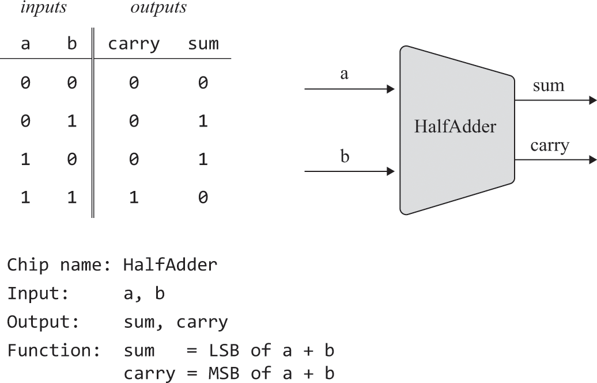
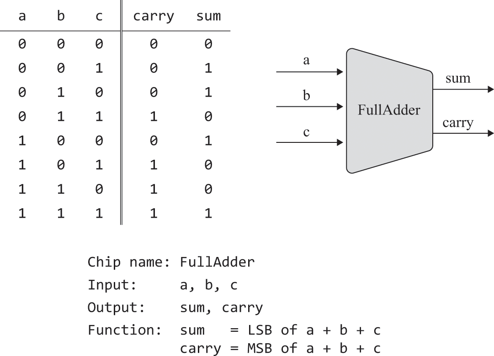
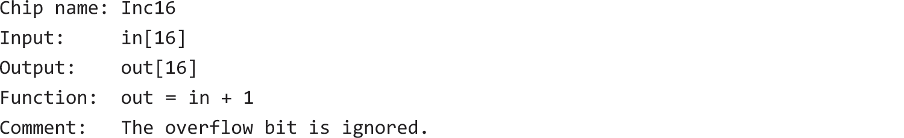
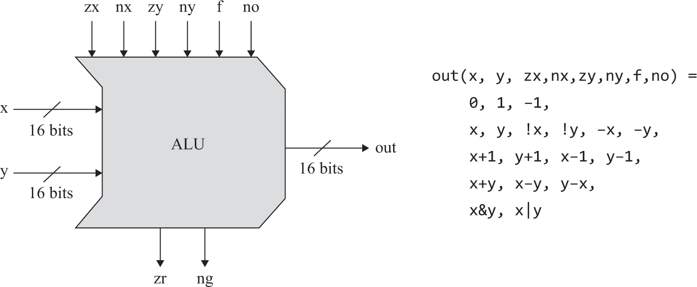
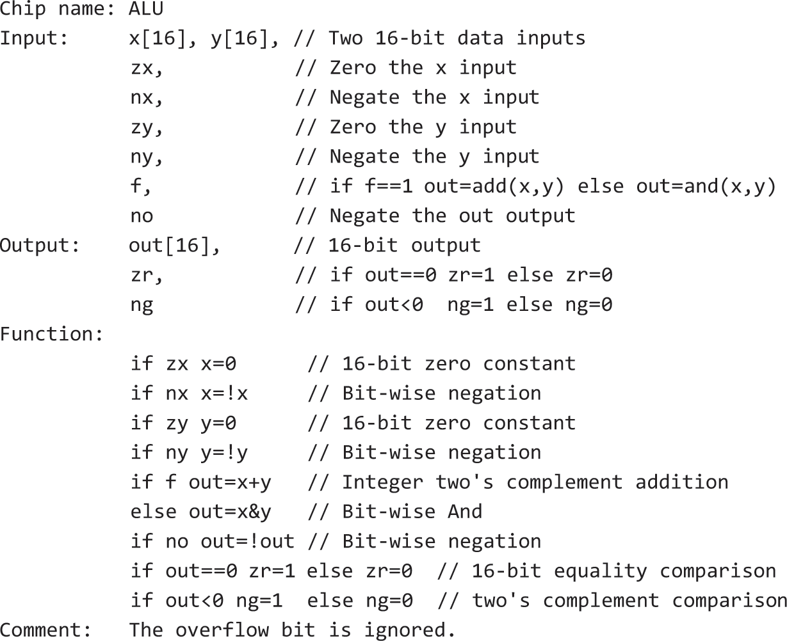

# 02.布尔算术

### 概述
```text
计算机的所有功能都可简化为二进制加法。硬件构造时位数是确定的，假如只有非负整数，那么n位寄存器只能表示[0, (2^n)-1]。而高级语言提供的无限大小的数字运算通常是将足够的寄存器捆绑使用，这种运算的效率较低。
```
```text
在若干表示符号二进制的编码方案中，几乎所有现代计算机都采用硬件实现不复杂的“补码”方式。采用“补码”方式，-x在n位二进制系统中以被表示为(2^n)-x。通过观察结果，可发现补码的如下特性：
· 在n位系统中的表示范围为：[-(2^(n-1)), (2^(n-1))-1]
· 正数最高位是0，负数最高位是1
· 将x取反有两种方法
	1. 找到最小有效位1，将它的更高位（不包括自身）全部反转
	2. 反转所有位，结果加1
· x-y可被x+(-y)实现
```
```text
全加器的得名因为其实现细节可由两个半加器组成。
```
```text
对计算结果忽略溢出，从产生的结果来看。对于3位二进制系统，表示范围为-4~3，假如从0开始不断加1，结果会出现如下循环：
	0, 1, 2, 3, 0, -1, -2, -3, -4……
```

<br>
<br>

### 习题

<hr>
<br>
<br>


⚠️非HDL描述
```text
通过观察真值表，得出
sum=Xor(a, b)
carry=And(a, b)
```

<br>
<br>
<hr>
<br>
<br>


```text
和是a、b、c两次半加的和，进位是a、b、c两次半加的进位的和
HalfAdder(a=a, b=b, sum=sumab, carry=carry1);
HalfAdder(a=sumab, b=c, sum=sum, carry=carry2);
HalfAdder(a=carry1, b=carry2, sum=carry);
```

<br>
<br>
<hr>
<br>
<br>


```text
使用全加实现，c为上次的进位，首次进位0，每次的sum作为out
FullAdder(a=a[0], b=b[0], c=0, sum=out[0], carry=c0);
FullAdder(a=a[1], b=b[1], c=c0, sum=out[1], carry=c1);
...
FullAdder(a=a[15], b=b[15], c=c14, sum=out[15]);
```

<br>
<br>
<hr>
<br>
<br>


```text
Add16(a=in[0..15], b[0]=true, b[0..15]=false, out=out);
```

<br>
<br>
<hr>
<br>
<br>



```text
// 所有条件分支通过选择器实现

// zx
And16(a=x[0..15], b[0..15]=false, out=zeroX);
Mux16(a=x[0..15], b=zeroX, sel=zx, out=afterZx);

// nx
Not16(in=afterZx, out=notX);
Mux16(a=afterZx, b=notX, sel=nx, out=afterNx);

// zy
And16(a=y[0..15], b[0..15]=false, out=zeroY);
Mux16(a=y[0..15], b=zeroY, sel=zy, out=afterZy);

// ny
Not16(in=afterZy, out=notY);
Mux16(a=afterZy, b=notY, sel=ny, out=afterNy);

// f
Add16(a=afterNx, b=afterNy, out=addXy);
And16(a=afterNx, b=afterNy, out=andXy);
Mux16(a=andXy, b=addXy, sel=f, out=afterF);

// no
Not16(in=afterF, out=notOut);
// 输出out
Mux16(a=afterF, b=notOut, sel=no, out=res, out=out);

// zr
// 如果结果值的低15位全0，则结果=0
Or16(a=res, b[0..15]=false, out[0..7]=lowRes, out[8..14]=highRes);
// 不可直接使用res[0..7]，需要先通过某个逻辑门将指定位范围输出
Or8Way(in=lowRes, out=lowZr8);
Or8Way(in[0..6]=highRes, in[7]=false, out=highZr8);
Or(a=lowZr8, b=highZr8, out=notZr);
// 输出zr
Not(in=notZr, out=zr);

// ng
// 如果最高位为1，并且结果非0，则ng=1
Or16(a=res, b[0..15]=false, out[15]=highestRes);
Or(a=highestRes, b=false, out=highestResTrue);
// 输出ng
And(a=highestResTrue, b=notZr, out=ng);
```