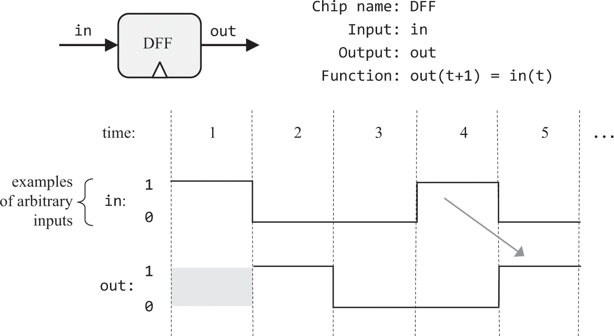

# 内存

### DFF


<br>

利用石英晶体的压电效应可每隔一段时间t产生一个信号，被称作时钟信号，t是稳定精确的，书中通过同样可被Nand构建的DFF来响应时钟信号。

它在t2时输出其在t1时收到的信号，既用于"存储"，又使芯片可按步骤工作，屏蔽信号传输时延。那么t应被调整为大于整个硬件中最慢操作的耗时。

## 习题

### Bit


<br>

<br>

```text
// 按图示连接
Mux(a=copyOut, b=in, sel=load, out=inDff);
DFF(in=inDff, out=out, out=copyOut);
```

### Register


<br>

```text
// 进入按位连接
Bit(in=in[0], load=load, out=out[0]);
Bit(in=in[1], load=load, out=out[1]);
Bit(in=in[2], load=load, out=out[2]);
Bit(in=in[3], load=load, out=out[3]);
Bit(in=in[4], load=load, out=out[4]);
Bit(in=in[5], load=load, out=out[5]);
Bit(in=in[6], load=load, out=out[6]);
Bit(in=in[7], load=load, out=out[7]);
Bit(in=in[8], load=load, out=out[8]);
Bit(in=in[9], load=load, out=out[9]);
Bit(in=in[10], load=load, out=out[10]);
Bit(in=in[11], load=load, out=out[11]);
Bit(in=in[12], load=load, out=out[12]);
Bit(in=in[13], load=load, out=out[13]);
Bit(in=in[14], load=load, out=out[14]);
Bit(in=in[15], load=load, out=out[15]);
```

### RAM


<br>

n指地址数，将依次实现这些n数{8, 64, 512, 4K, 16K}，其对应的address位数k={3, 6, 9, 12, 14}

```text
// RAM8
// 用address将load信号分解到各Register控制其是否接收in
// 用address选择各Register的输出至out
Register(in=in, load=load0, out=out0);
Register(in=in, load=load1, out=out1);
Register(in=in, load=load2, out=out2);
Register(in=in, load=load3, out=out3);
Register(in=in, load=load4, out=out4);
Register(in=in, load=load5, out=out5);
Register(in=in, load=load6, out=out6);
Register(in=in, load=load7, out=out7);
DMux8Way(in=load, sel=address, a=load0, b=load1, c=load2, d=load3, e=load4, f=load5, g=load6, h=load7);
Mux8Way16(a=out0, b=out1, c=out2, d=out3, e=out4, f=out5, g=out6, h=out7, sel=address, out=out);

// RAM64
// 用address[3..5]将load分解到各RAM8
// 用address[3..5]选择各RAM8的输出至out
RAM8(in=in, load=load0, address=address[0..2], out=out0);
RAM8(in=in, load=load1, address=address[0..2], out=out1);
RAM8(in=in, load=load2, address=address[0..2], out=out2);
RAM8(in=in, load=load3, address=address[0..2], out=out3);
RAM8(in=in, load=load4, address=address[0..2], out=out4);
RAM8(in=in, load=load5, address=address[0..2], out=out5);
RAM8(in=in, load=load6, address=address[0..2], out=out6);
RAM8(in=in, load=load7, address=address[0..2], out=out7);
DMux8Way(in=load, sel=address[3..5], a=load0, b=load1, c=load2, d=load3, e=load4, f=load5, g=load6, h=load7);
Mux8Way16(a=out0, b=out1, c=out2, d=out3, e=out4, f=out5, g=out6, h=out7, sel=address[3..5], out=out);

// RAM512
// 用address[6..8]将load分解到各RAM64
// 用address[6..8]选择各RAM64的输出至out
RAM64(in=in, load=load0, address=address[0..5], out=out0);
RAM64(in=in, load=load1, address=address[0..5], out=out1);
RAM64(in=in, load=load2, address=address[0..5], out=out2);
RAM64(in=in, load=load3, address=address[0..5], out=out3);
RAM64(in=in, load=load4, address=address[0..5], out=out4);
RAM64(in=in, load=load5, address=address[0..5], out=out5);
RAM64(in=in, load=load6, address=address[0..5], out=out6);
RAM64(in=in, load=load7, address=address[0..5], out=out7);
DMux8Way(in=load, sel=address[6..8], a=load0, b=load1, c=load2, d=load3, e=load4, f=load5, g=load6, h=load7);
Mux8Way16(a=out0, b=out1, c=out2, d=out3, e=out4, f=out5, g=out6, h=out7, sel=address[6..8], out=out);

// RAM4K
// 用address[9..11]将load分解到各RAM512
// 用address[9..11]选择各RAM512的输出至out
RAM512(in=in, load=load0, address=address[0..8], out=out0);
RAM512(in=in, load=load1, address=address[0..8], out=out1);
RAM512(in=in, load=load2, address=address[0..8], out=out2);
RAM512(in=in, load=load3, address=address[0..8], out=out3);
RAM512(in=in, load=load4, address=address[0..8], out=out4);
RAM512(in=in, load=load5, address=address[0..8], out=out5);
RAM512(in=in, load=load6, address=address[0..8], out=out6);
RAM512(in=in, load=load7, address=address[0..8], out=out7);
DMux8Way(in=load, sel=address[9..11], a=load0, b=load1, c=load2, d=load3, e=load4, f=load5, g=load6, h=load7);
Mux8Way16(a=out0, b=out1, c=out2, d=out3, e=out4, f=out5, g=out6, h=out7, sel=address[9..11], out=out);

// RAM16K
// 用address[12..13]将load分解到各RAM4K
// 用address[12..13]选择各RAM4K的输出至out
RAM4K(in=in, load=load0, address=address[0..11], out=out0);
RAM4K(in=in, load=load1, address=address[0..11], out=out1);
RAM4K(in=in, load=load2, address=address[0..11], out=out2);
RAM4K(in=in, load=load3, address=address[0..11], out=out3);
DMux4Way(in=load, sel=address[12..13], a=load0, b=load1, c=load2, d=load3);
Mux4Way16(a=out0, b=out1, c=out2, d=out3, sel=address[12..13], out=out);
```

### PC


<br>

```text
// 原始答案
elif和else只有在前置条件不成立时才执行
// reset
Mux16(a=lastRes, b[0..15]=false, sel=reset, out=afterReset);
// load
// !reset && load
Xor(a=reset, b=true, out=notSet);
And(a=notSet, b=load, out=whetherLoad);
Mux16(a=afterReset, b=in, sel=whetherLoad, out=afterLoad);
// inc
// !reset && !load && inc
Xor(a=load, b=true, out=notLoad);
And(a=notSet, b=notLoad, out=notSetNotLoad);
And(a=notSetNotLoad, b=inc, out=whetherInc);
Inc16(in=afterLoad, out=incRes);
Mux16(a=afterLoad, b=incRes, sel=whetherInc, out=waitOut);
// 通过寄存器添加时序逻辑和回路反馈
Register(in=waitOut, load=true, out=out, out=lastRes);

// 以下答案来自：https://github.com/woai3c/nand2tetris/blob/master/03/a/PC.hdl
Mux16(a=preOut, b=addOut, sel=inc, out=o1);
Mux16(a=o1, b=in, sel=load, out=o2);
Mux16(a=o2, b=false, sel=reset, out=o3);
Register(in=o3, load=true, out=preOut, out=out);
Inc16(in=preOut, out=addOut);
```
