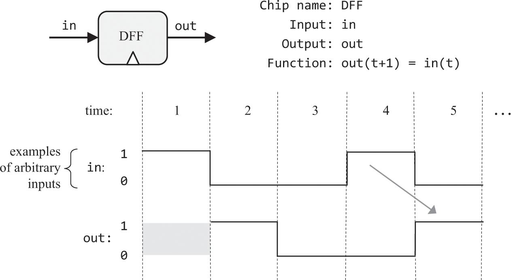
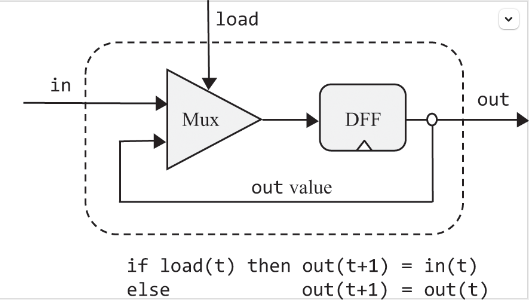
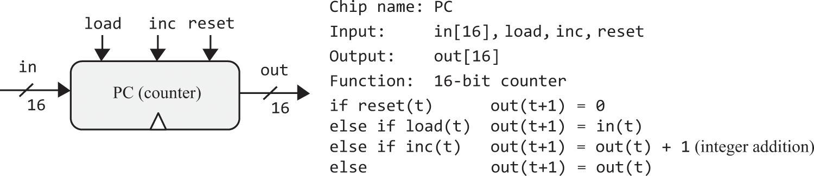

# 03.内存

### 概述
```text
书中例子，内存的底层设备选用数据触发器（DFF），现代计算机内存底层设备不一定是DFF，可能是其他独有的物理特性。DFF也可以仅通过Nand构建，但很复杂，所以书中的例子将其作为原始逻辑门使用。其使用方式如下图
```

```text
所有内存芯片都含数据触发器（DFF）。所有的DFF通过专用的时间总线同时接收到由振荡器发出的时钟周期信号（tick-tock），DFF在每个周期结束（tock）时输出结束前时间还处于周期内（范围：(上一个tock, 当前tock) ）时的输入。
```
```text
· 时序逻辑既结合DFF达到“记忆/存储”的效果，也用于同步不同的物理时延。假如ALU的两个入参在不同时间到达ALU，那么ALU将输出错误的结果。所以时钟周期在必须大于整个硬件最长时延的同时，又要尽可能短，周期越短速度越快。
·  访问RAM的不同地址，所花时间是相同的。
```

<br>
<br>

### 习题
<hr>
<br>
<br>


```text
按照图示连接
Mux(a=dffOut, b=in, sel=load, out=dffIn);
DFF(in=dffIn, out=dffOut, out=out);
```

<br>
<br>
<hr>
<br>
<br>


```text
如果有16位的DFF，可以像Bit一样连接。因为没有，所以使用16个Bit
Bit(in = in[0], load = load, out = out[0]);
...
Bit(in = in[15], load = load, out = out[15]);
```

<br>
<br>
<hr>
<br>
<br>


```text
这个n指的是地址数，将依次实现这些n数{8, 64, 512, 4K, 16K}，其对应的address位数k={3, 6, 9, 12, 14}，地址位数递增的个数有助于使用已构建好的RAM

RAM8
在输入时，要根据3位地址的值来选取8个寄存器，可用8路分解器。而在输出时使用16位8路选择器。
8路分解器是1位的，不能用来传递in，但可以用来传递load，它选择的结果作为各寄存器的load位。没有被选择的寄存器不读入值，但它们依旧输出，所以它们的输出还要经过16位8路选择器筛选。
DMux8Way(in=load, sel=address, a=inR0, b=inR1, c=inR2, d=inR3, e=inR4, f=inR5, g=inR6, h=inR7);
Register(in=in, load=inR0, out=outR0);
Register(in=in, load=inR1, out=outR1);
Register(in=in, load=inR2, out=outR2);
Register(in=in, load=inR3, out=outR3);
Register(in=in, load=inR4, out=outR4);
Register(in=in, load=inR5, out=outR5);
Register(in=in, load=inR6, out=outR6);
Register(in=in, load=inR7, out=outR7);
Mux8Way16(a=outR0, b=outR1, c=outR2, d=outR3, e=outR4, f=outR5, g=outR6, h=outR7, sel=address, out=out);

RAM64
把RAM8看成整体使用，用address的高3位选择使用哪个RAM8
DMux8Way(in=load, sel=address[3..5], a=inR0, b=inR1, c=inR2, d=inR3, e=inR4, f=inR5, g=inR6, h=inR7);
RAM8(in=in, load=inR0, address=address[0..2], out=outR0);
RAM8(in=in, load=inR1, address=address[0..2], out=outR1);
RAM8(in=in, load=inR2, address=address[0..2], out=outR2);
RAM8(in=in, load=inR3, address=address[0..2], out=outR3);
RAM8(in=in, load=inR4, address=address[0..2], out=outR4);
RAM8(in=in, load=inR5, address=address[0..2], out=outR5);
RAM8(in=in, load=inR6, address=address[0..2], out=outR6);
RAM8(in=in, load=inR7, address=address[0..2], out=outR7);
Mux8Way16(a=outR0, b=outR1, c=outR2, d=outR3, e=outR4, f=outR5, g=outR6, h=outR7, sel=address[3..5], out=out);

RAM512
DMux8Way(in=load, sel=address[6..8], a=inR0, b=inR1, c=inR2, d=inR3, e=inR4, f=inR5, g=inR6, h=inR7);
RAM64(in=in, load=inR0, address=address[0..5], out=outR0);
RAM64(in=in, load=inR1, address=address[0..5], out=outR1);
RAM64(in=in, load=inR2, address=address[0..5], out=outR2);
RAM64(in=in, load=inR3, address=address[0..5], out=outR3);
RAM64(in=in, load=inR4, address=address[0..5], out=outR4);
RAM64(in=in, load=inR5, address=address[0..5], out=outR5);
RAM64(in=in, load=inR6, address=address[0..5], out=outR6);
RAM64(in=in, load=inR7, address=address[0..5], out=outR7);
Mux8Way16(a=outR0, b=outR1, c=outR2, d=outR3, e=outR4, f=outR5, g=outR6, h=outR7, sel=address[6..8], out=out);

RAM4K
DMux8Way(in=load, sel=address[9..11], a=inR0, b=inR1, c=inR2, d=inR3, e=inR4, f=inR5, g=inR6, h=inR7);
RAM512(in=in, load=inR0, address=address[0..8], out=outR0);
RAM512(in=in, load=inR1, address=address[0..8], out=outR1);
RAM512(in=in, load=inR2, address=address[0..8], out=outR2);
RAM512(in=in, load=inR3, address=address[0..8], out=outR3);
RAM512(in=in, load=inR4, address=address[0..8], out=outR4);
RAM512(in=in, load=inR5, address=address[0..8], out=outR5);
RAM512(in=in, load=inR6, address=address[0..8], out=outR6);
RAM512(in=in, load=inR7, address=address[0..8], out=outR7);
Mux8Way16(a=outR0, b=outR1, c=outR2, d=outR3, e=outR4, f=outR5, g=outR6, h=outR7, sel=address[9..11], out=out);

RAM16K
地址位数增加了2，需要用4路的分解器和选择器，分解器仍为1位的
DMux4Way(in=load, sel=address[12..13], a=inR0, b=inR1, c=inR2, d=inR3);
RAM4K(in=in, load=inR0, address=address[0..11], out=outR0);
RAM4K(in=in, load=inR1, address=address[0..11], out=outR1);
RAM4K(in=in, load=inR2, address=address[0..11], out=outR2);
RAM4K(in=in, load=inR3, address=address[0..11], out=outR3);
Mux4Way16(a=outR0, b=outR1, c=outR2, d=outR3, sel=address[12..13], out=out);
```

<br>
<br>
<hr>
<br>
<br>


```text
elif和else只有在前置条件不成立时才执行
// reset
Mux16(a=lastRes, b[0..15]=false, sel=reset, out=afterReset);
// load
// !reset && load
Xor(a=reset, b=true, out=notSet);
And(a=notSet, b=load, out=whetherLoad);
Mux16(a=afterReset, b=in, sel=whetherLoad, out=afterLoad);
// inc
// !reset && !load && inc
Xor(a=load, b=true, out=notLoad);
And(a=notSet, b=notLoad, out=notSetNotLoad);
And(a=notSetNotLoad, b=inc, out=whetherInc);
Inc16(in=afterLoad, out=incRes);
Mux16(a=afterLoad, b=incRes, sel=whetherInc, out=waitOut);
// 通过寄存器添加时序逻辑和回路反馈
Register(in=waitOut, load=true, out=out, out=lastRes);
----------------------------------------------
⚠️上边是我最初的想法，每下一个条件都判断所有前置条件是否成立，非常冗余和不易扩展，下面是我参考的https://github.com/woai3c/nand2tetris的，挺好，先执行条件判断顺序最末尾的，如果前置条件成立，以前置条件为准👍
Inc16(in=lastRes, out=incRes);
Mux16(a=lastRes, b=incRes, sel=inc, out=afterInc);
Mux16(a=afterInc, b=in, sel=load, out=afterLoad);
Mux16(a=afterLoad, b[0..15]=false, sel=reset, out=res);
Register(in=res, load=true, out=lastRes, out=out);
```