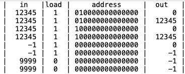
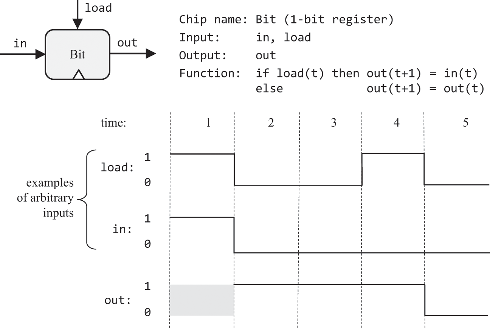
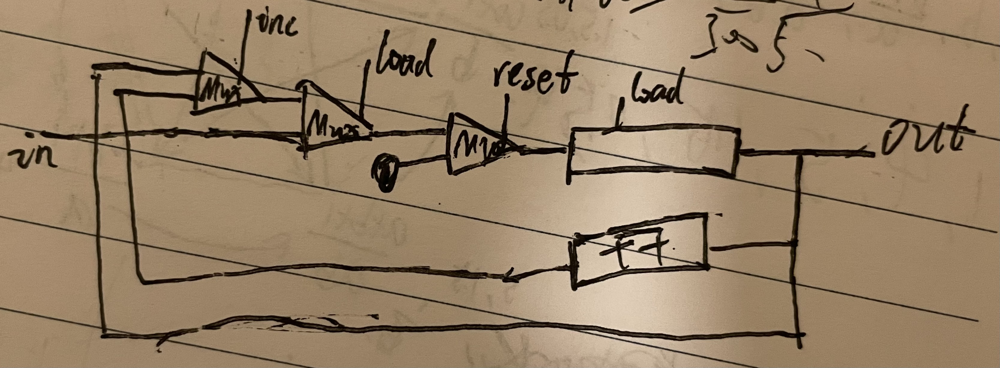

# 03.时钟周期和存储

### 概述
```text
· 时钟周期是固定长度的间隔，是原子和不可分割的。我们不关心一个周期开始后的变化，只在一个周期结束后观察芯片的输出。以此消除不同芯片传输数据和计算花费时间的不同，所以周期长度需大于系统中任何可能出现的最长时延，那么周期越短也就意味着速度越快。
· 内存芯片旨在随着时间的推移“记住”信息。能完成这个的底层设备被称为触发器门，书中的例子使用DFF作为触发器，其包含1位输入、时钟输入、1位输出。在每个时间单位结束时，DFF输出上一个时间单位的输入out(t) = in(t-1)，而在所有其他时间都输出最后一次保存的结果。我此时给DFF输入了一个值，那么要到下一个时钟周期我DFF才输出那个值，在此时的周期，虽然我已经给了它新值，但它输出的是它自己最后一次保存的那个值。
· DFF可以由Nand实现，但在本例中将它看作像Nand一样是原始的，因为现代计算机的内存底层不一定是由DFF实现的。本例的寄存器、RAM、计数器都基于DFF实现。
· 任何包含了DFF的芯片都被视为与时间有关的，前面单独的基本逻辑门和ALU都是与时间无关的。时钟周期信号由一个振荡器产生，并使用专用的时间总线同时广播到系统的所有DFF中。
· 通过Mux+DFF可以制作一位寄存器，RAM内是多个多位寄存器，通过传入的地址参数来决定访问哪一个，对RAM中任何寄存器的访问都是瞬时的，与位置和大小无关。
```
⚠️有个事儿我不明白，下边是05章Memory的对比文件。每一行是一个时钟周期吗？我觉得第三行和第五行也该是12345


### 习题


```text
采用HDL描述
Mux(a = dffOut, b = in, sel = load, out = dffIn);
DFF(in = dffIn, out = dffOut);
Or(a = dffOut, b = false, out = out);
```

```text
采用HDL描述
Bit(in = in[0], load = load, out = out[0]);
...
Bit(in = in[15], load = load, out = out[15]);
```

```text
RAM8
采用HDL描述
	DMux8Way(in = load, sel = address, a = loadA, b = loadB, c = loadC, d = loadD, e = loadE, f = loadF, g = loadG, h = loadH);
	Register(in = in, load = loadA, out = o1);
	Register(in = in, load = loadB, out = o2);
	Register(in = in, load = loadC, out = o3);
	Register(in = in, load = loadD, out = o4);
	Register(in = in, load = loadE, out = o5);
	Register(in = in, load = loadF, out = o6);
	Register(in = in, load = loadG, out = o7);
	Register(in = in, load = loadH, out = o8);
	Mux8Way16(a = o1, b = o2, c = o3, d = o4, e = o5, f = o6, g = o7, h = o8, sel = address, out = out);

RAM64
采用HDL描述
	DMux8Way(in = load, sel = address[3..5], a = loadA, b = loadB, c = loadC, d = loadD, e = loadE, f = loadF, g = loadG, h = loadH);
	RAM8(in = in, load = loadA, address = address[0..2], out = o1);
	RAM8(in = in, load = loadB, address = address[0..2], out = o2);
	RAM8(in = in, load = loadC, address = address[0..2], out = o3);
	RAM8(in = in, load = loadD, address = address[0..2], out = o4);
	RAM8(in = in, load = loadE, address = address[0..2], out = o5);
	RAM8(in = in, load = loadF, address = address[0..2], out = o6);
	RAM8(in = in, load = loadG, address = address[0..2], out = o7);
	RAM8(in = in, load = loadH, address = address[0..2], out = o8);
	Mux8Way16(a = o1, b = o2, c = o3, d = o4, e = o5, f = o6, g = o7, h = o8, sel = address[3..5], out = out);

RAM512
采用HDL描述
	DMux8Way(in = load, sel = address[6..8], a = loadA, b = loadB, c = loadC, d = loadD, e = loadE, f = loadF, g = loadG, h = loadH);
	RAM64(in = in, load = loadA, address = address[0..5], out = o1);
	RAM64(in = in, load = loadB, address = address[0..5], out = o2);
	RAM64(in = in, load = loadC, address = address[0..5], out = o3);
	RAM64(in = in, load = loadD, address = address[0..5], out = o4);
	RAM64(in = in, load = loadE, address = address[0..5], out = o5);
	RAM64(in = in, load = loadF, address = address[0..5], out = o6);
	RAM64(in = in, load = loadG, address = address[0..5], out = o7);
	RAM64(in = in, load = loadH, address = address[0..5], out = o8);
	Mux8Way16(a = o1, b = o2, c = o3, d = o4, e = o5, f = o6, g = o7, h = o8, sel = address[6..8], out = out);

RAM4K
采用HDL描述
	DMux8Way(in = load, sel = address[9..11], a = loadA, b = loadB, c = loadC, d = loadD, e = loadE, f = loadF, g = loadG, h = loadH);
	RAM512(in = in, load = loadA, address = address[0..8], out = o1);
	RAM512(in = in, load = loadB, address = address[0..8], out = o2);
	RAM512(in = in, load = loadC, address = address[0..8], out = o3);
	RAM512(in = in, load = loadD, address = address[0..8], out = o4);
	RAM512(in = in, load = loadE, address = address[0..8], out = o5);
	RAM512(in = in, load = loadF, address = address[0..8], out = o6);
	RAM512(in = in, load = loadG, address = address[0..8], out = o7);
	RAM512(in = in, load = loadH, address = address[0..8], out = o8);
	Mux8Way16(a = o1, b = o2, c = o3, d = o4, e = o5, f = o6, g = o7, h = o8, sel = address[9..11], out = out);

RAM16K
采用HDL描述
	DMux4Way(in = load, sel = address[12..13], a = loadA, b = loadB, c = loadC, d = loadD);
	RAM4K(in = in, load = loadA, address = address[0..11], out = o1);
	RAM4K(in = in, load = loadB, address = address[0..11], out = o2);
	RAM4K(in = in, load = loadC, address = address[0..11], out = o3);
	RAM4K(in = in, load = loadD, address = address[0..11], out = o4);
	Mux4Way16(a = o1, b = o2, c = o3, d = o4, sel = address[12..13], out = out);
```

⚠️自己写了一个不对，抄的https://github.com/woai3c/nand2tetris的，但是画了个图没搞懂

```text
采用HDL描述
Mux16(a = preOut, b = addOut, sel = inc, out = o1);
Mux16(a = o1, b = in, sel = load, out = o2);
Mux16(a = o2, b = false, sel = reset, out = o3);
Register(in = o3, load = true, out = preOut, out = out);
Inc16(in = preOut, out = addOut);
```