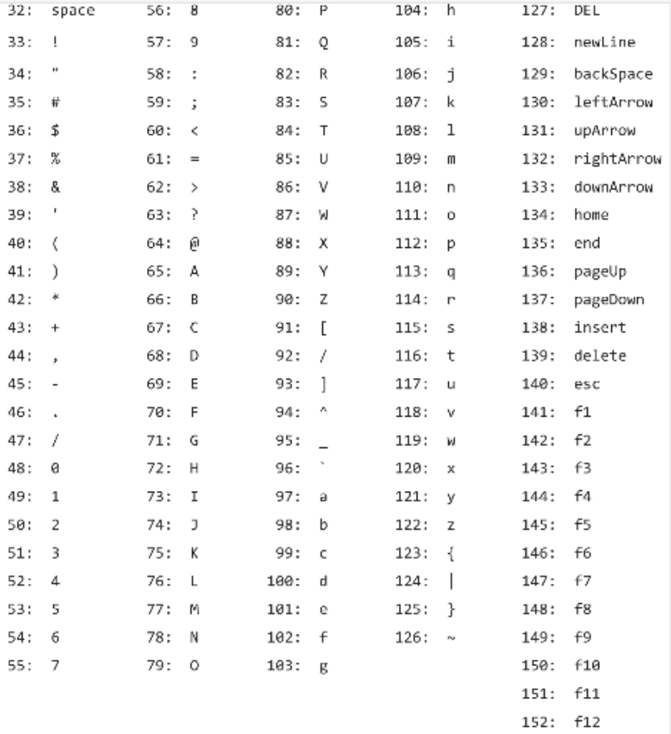

# 机器语言

机器语言是软硬件的分界线，是硬件平台的一部分。可以说它被设计用来控制指定的硬件平台，也可以说硬件平台被设计用来执行特定的机器语言

### 汇编

- 机器语言的符号版本，和机器语言一一对应，同样是硬件平台的一部分，不能跨硬件平台
- "伪指令"没有对应的机器指令，例如声明标签
- goto奥一个符号而不是汇编地址，被称为"可重定位的"
- 机器指令第一行为0行，在Hack平台中，第n行会被加载到ROM[n]

### 语法


<br>

- 可读可写的RAM用于存放数据，只读的ROM用于存放指令。
- A寄存器的值同时是RAM、ROM的地址。
- M寄存器的值是RAM在地址A处的数据。
- D寄存器单纯的用于存放数据。
- 使用常量的唯一方式是@17，这将会把17置入A，如果要使用它，还要通过D=A将其复制到D。例如要将RAM[100]置为17：@17, D=A, @100, M=D
- 要跳转到ROM[29]执行：@29, 0;JMP
- 当D==0时跳抓到ROM[29]：@29, D;JEQ
- 设置变量x=17：@17, D=A, @x, M=D。汇编器将为x分配一个内存地址并保管x和内存地址的映射关系。
- 汇编器还处理一些内置符号：
  - R0..R15，代表0..15，所以@R3等同于@3。
  - SCREEN代表16384，是将显存映射到内存的商定地址。那么要使屏幕的第row行第col列的像素变黑，就要计算RAM[SCREEN + row*32 + col/16]，使其col%16位为1。
  - KBD代表24576，是将键盘映射到内存的商定地址。当按下键盘时，对应字母的码值会以16位二进制形式放置在RAM[KBD]上，没有按键时为0。其他高级操作 将由操作系统负责完成。

### 字符编码集



### 指针示例


## 习题

#### RAM[2] = RAM[0] * RAM[1]，不考虑操作数小于0的情况

```text
// 需修改测试脚本的repeat全部为210，否则时间不够
    // if (RAM[0] > RAM[1]) {
    //     count = RAM[1];
    //     num = RAM[0];
    // } else {
    //     count = RAM[0];
    //     num = RAM[1];
    // }
    // res = 0;
    // count--;
    // for (i = 0; i <= count; i++) {
    //     res += num;
    // }
    @R0
    D=M
    @R1
    D=D-M
    @R0_BIGGER
    D;JGT

    // r0 <= r1
    @R0
    D=M
    @count
    M=D
    @R1
    D=M
    @num
    M=D
(CORE)
    // res = 0
    @0
    D=A
    @res
    M=D
    // n--
    @1
    D=A
    @count
    M=M-D
    // i = 0
    @0
    D=A
    @i
    M=D
(LOOP)
    @i
    D=M
    @count
    D=D-M
    @STORE_RESULT
    D;JGT
    // res += num
    @num
    D=M
    @res
    M=D+M
    // i++
    @1
    D=A
    @i
    M=D+M
    @LOOP
    0;JMP

// r0 > r1
(R0_BIGGER)
    @R1
    D=M
    @count
    M=D
    @R0
    D=M
    @num
    M=D
    @CORE
    0;JMP

(STORE_RESULT)
    @res
    D=M
    @R2
    M=D
(END)
    @END
    0;JMP
```

#### 循环监听，按下键盘任意键则屏幕全黑，否则屏幕全白

```text
// 检测是否按键，按键则在整个屏幕变黑后才再次检测，变色过程很耗时，调到最快要花分钟。太慢了，这里只做524个像素变色。
    // while (1) {
    //     color = RAM[KBD] > 0 ? -1 : 0;
    //     屏幕256行，每行512像素，这里只弄前1024个像素，要不没完了，太慢太慢，但程序好像实际改变了65个寄存器，两行外加32位的颜色都被改了🤷‍♂️，懒得找原因了。
    //     // screen_max_address = SCREEN + 256*512/16;
    //     screen_max_address = SCREEN + 2*512/16;
    //     for (i = SCREEN; i < screen_max_address; i++) {
    //     RAM[i] = color;
    //     }
    // }

    // @8192
    @64
    D=A
    @SCREEN
    D=D+A
    @screen_max_address
    M=D

(LOOP_OUT)
    // 默认填充白色，默认0以便黑色时直接-1
    @0
    D=A
    @color
    M=D
    // 是否要填充黑色
    @KBD
    D=M
    @BLACK_VALUE
    D;JGT
(CORE)
    @SCREEN
    D=A
    @i
    M=D
(LOOP_IN)
    @i
    D=M
    @screen_max_address
    D=D-M
    @LOOP_OUT
    D;JGE
    @color
    D=M
    @i
    A=M
    M=D
    @i
    M=M+1
    @LOOP_IN
    0;JMP

(BLACK_VALUE)
    @color
    M=M-1
    @CORE
    0;JMP
```