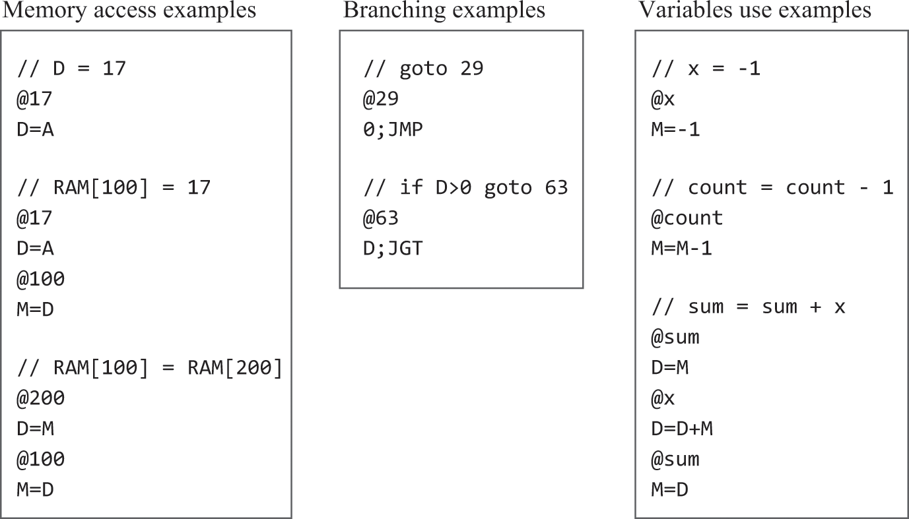
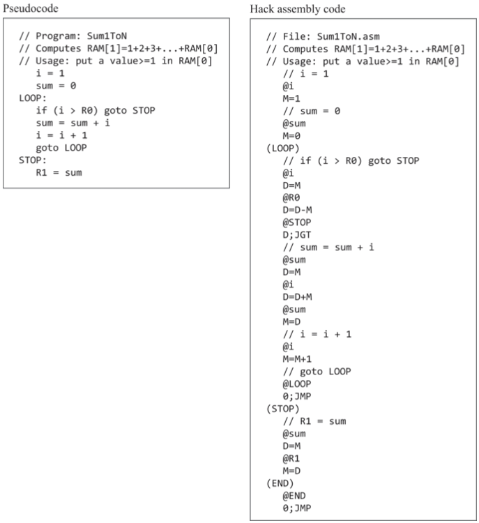
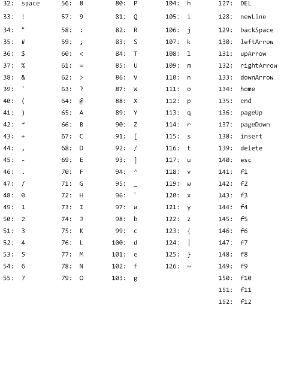
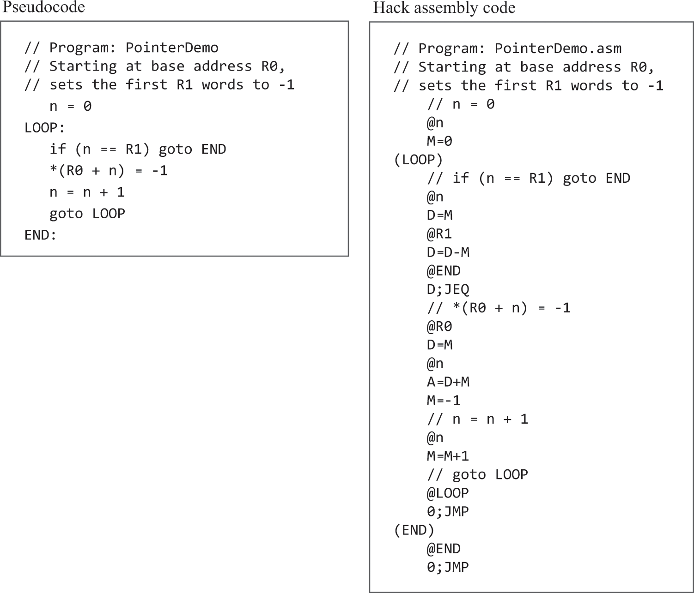

# 04.机器/汇编语言

### 概述
```text
· 机器语言是对硬件的直接控制，目的在于通过寄存器控制内存。和硬件强相关（ALU的操作方式、寄存器的类型和数量、内存大小...），不跨CPU架构，但不同汇编的任务集是相似通用的。机器语言的文字版（汇编）是人类抽象和机器执行的交界点。
· 分支和循环是以跳转完成的。使用符号引用而非汇编地址的代码的翻译二进制版本可以加载到计算机内存中碰巧可用的任何内存段并从中执行，不提及物理地址的低级代码被称为可重定位。
· 本例中不能像大多数汇编语言一样在同一条语句中指定地址和操作数。
· 本例目前阶段假设自己可以使用汇编器，实际上要在06才会完成。本例的硬件设计是冯诺依曼16位，有两个内存：数据内存RAM、指令内存ROM，各15位地址空间。RAM可读可写，ROM只读，写入采用外源方式，见05。地址寄存器：保存即将操作内存块的地址，本例称为A；数据寄存器：保存即将被处理的数据，本例称为D。而选定的RAM中的寄存器称为M。
```

```text
· 本例的语法：A既是地址寄存器也是数据寄存器。
· 将常量输入系统的唯一方式是@n（0<=n<=2^15 - 1）将会把n放入A中，而这也会使M和ROM中位于1的指令被选中用于后续操作。
· 标签被绑定成下一条指令的地址，用于跳转，可以是非数字开头的_.$:和数字的组合。
· 前导空格、空行和注释行将被忽略。
· 标签、内置符号用大写，变量用小写。
· 变量符号会被汇编器绑定一个大于等于16的唯一地址数，程序中可直接食用@变量符号，地址由汇编器负责转换。
· 内置符号R0~R15，代表值0～15，也被称为虚拟寄存器。
· 汇编程序以结尾无限循环跳转为结束，避免执行未知指令。
```


```text
· 本例的二进制指令设计。C-instruction的comp(二进制的acccccc位)用以选择ALU函数，comp的计算值将被存储到dest(二进制的ddd位)，jump决定是继续执行下一条指令还是跳转至A指向的ROM中的指令。
```

```text
· 内置符号SP, LCL, ARG, THIS, THAT分别代表0～4，在实现编译器时使用。
· 内置符号SCREEN和KBD分别被绑定到16384和24576，这是商定的屏幕和键盘的内存映射基地址。那么要使屏幕的第row行第col列的像素变黑，就要计算RAM[SCREEN + row*32 + col/16]，使其col%16位为1。当按下键盘时，对应字母的码值会以16位二进制形式放置在RAM[KBD]上，高级操作将由操作系统负责完成。
```

```text
· 本例的汇编文件扩展名为.asm，每行是A指令或C指令或标签声明或注释，标签和注释不会生成机器指令。汇编后的二进制指令文件扩展名为.hack。由n行16位二进制组成，每行是一个机器指令，第n行指令将出现在ROM[n]中。
```
```text
用指针操作数组元素示例
```


### 习题
#### RAM[2] = RAM[0] * RAM[1]，不考虑操作数小于0的情况
```text
	需要修改测试脚本的repeat全部为210，否则时间不够
	// if (RAM[0] > RAM[1]) {
	// 	count = RAM[1];
	// 	num = RAM[0];
	// } else {
	// 	count = RAM[0];
	// 	num = RAM[1];
	// }
	// res = 0;
	// count--;
	// for (i = 0; i <= count; i++) {
	// 	res += num;
	// }
	@R0
	D=M
	@R1
	D=D-M
	@R0_BIGGER
	D;JGT

	// r0 <= r1
	@R0
	D=M
	@count
	M=D
	@R1
	D=M
	@num
	M=D
(CORE)
	// res = 0
	@0
	D=A
	@res
	M=D
	// n--
	@1
	D=A
	@count
	M=M-D
	// i = 0
	@0
	D=A
	@i
	M=D
(LOOP)
	@i
	D=M
	@count
	D=D-M
	@STORE_RESULT
	D;JGT
	// res += num
	@num
	D=M
	@res
	M=D+M
	// i++
	@1
	D=A
	@i
	M=D+M
	@LOOP
	0;JMP

// r0 > r1
(R0_BIGGER)
	@R1
	D=M
	@count
	M=D
	@R0
	D=M
	@num
	M=D
	@CORE
	0;JMP

(STORE_RESULT)
	@res
	D=M
	@R2
	M=D
(END)
	@END
	0;JMP
```
#### 循环监听，按下键盘任意键则屏幕全黑，否则屏幕全白。
```text
	//检测是否按键，按键则在整个屏幕变黑后才再次检测，变色过程很耗时，调到最快要花分钟
	//太慢了，这里只做524个像素变色
	// while (1) {
	// 	color = RAM[KBD] > 0 ? -1 : 0;
	// 	屏幕256行，每行512像素，这里只弄前1024个像素，要不没完了，太慢太慢，但程序好像实际改变了65个寄存器，两行外加32位的颜色都被改了🤷‍♂️，懒得找原因了。
	// 	// screen_max_address = SCREEN + 256*512/16;
	// 	screen_max_address = SCREEN + 2*512/16;
	// 	for (i = SCREEN; i < screen_max_address; i++) {
	// 		RAM[i] = color;
	// 	}
	// }

	// @8192
	@64
	D=A
	@SCREEN
	D=D+A
	@screen_max_address
	M=D

(LOOP_OUT)
	// 默认填充白色，默认0以便黑色时直接-1
	@0
	D=A
	@color
	M=D
	// 是否要填充黑色
	@KBD
	D=M
	@BLACK_VALUE
	D;JGT
(CORE)
	@SCREEN
	D=A
	@i
	M=D
(LOOP_IN)
	@i
	D=M
	@screen_max_address
	D=D-M
	@LOOP_OUT
	D;JGE
	@color
	D=M
	@i
	A=M
	M=D
	@i
	M=M+1
	@LOOP_IN
	0;JMP

(BLACK_VALUE)
	@color
	M=M-1
	@CORE
	0;JMP
```