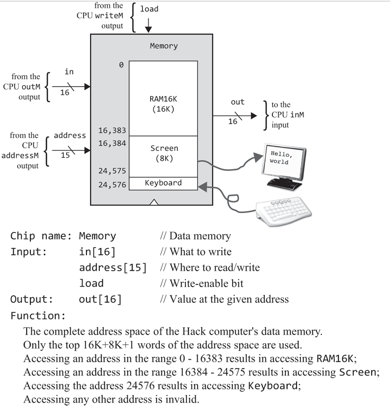
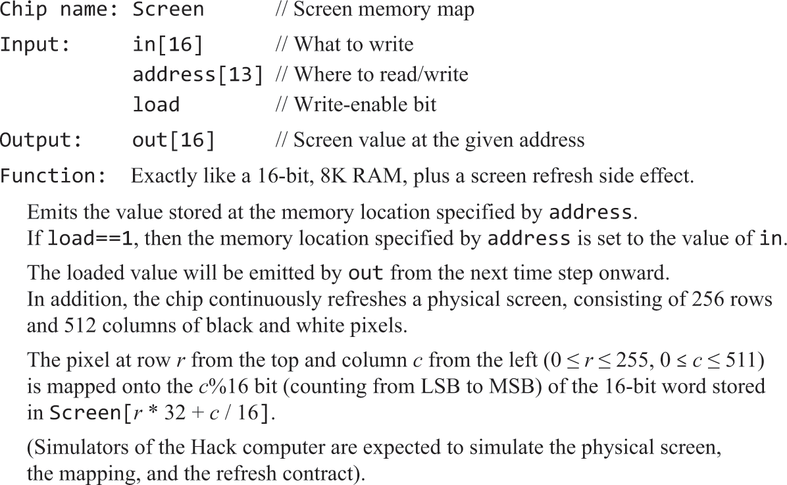
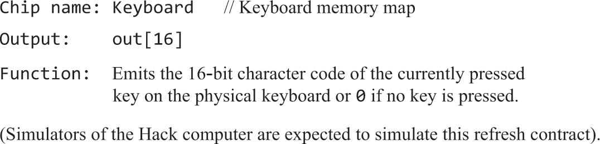
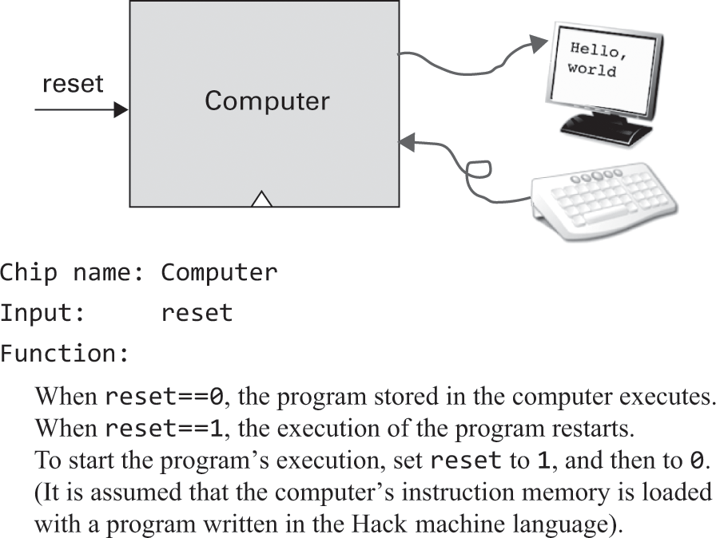
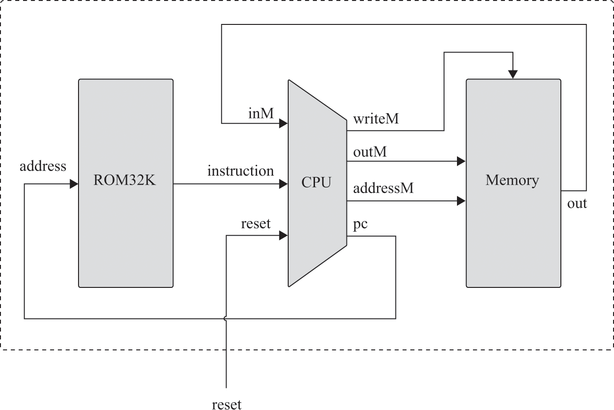

# 计算机体系结构

- 目标：集成已经构建的芯片，使其可运行第4章的机器语言
- 结构：CPU（ALU、D、A、PC）、RAM、ROM（不能动态加载程序）、SCREEN、KBD
- I/O驱动：由I/O硬件厂商提供，负责实现操作系统的I/O接口，实现操作系统希望执行的操作

### 冯诺依曼通用结构图


## 习题

### CPU


<br>

<br>

- 图中的c不是"是否c指令"，而是从指令中提取的控制位，ALU的c's代表C指令中用以选择函数的cccccc这6位
- A、D寄存器需分别使用内置芯片：ARegister、DRegister

**结合[语法设计图](./img/04/语法.png)解释**

- 通过指令最高位判断A、C指令
  - 对于A指令，将所有低位置入A寄存器，所有位也可以，因为只支持正数常量
  - 对于C指令
    - 通过a判断ALU除D外的另一个输入来自于A还是M
    - 通过cccccc选择ALU将执行的函数
    - 通过ddd选择ALU将输入到哪个寄存器
    - 通过jjj和ALU的zr、ng输出判断是否跳转：if jump; then PC=A; else PC++; fi
- 观察acccccc，D、A/M分别以x、y作为ALU的两个输入
- 三个寄存器的load条件通过观察ddd真值表得出

```text
    // 指令是否是c指令
    Xor(a=instruction[15], b=false, out=isC);
    Not(in=isC, out=isA);

    // A寄存器
// C指令下，是否将ALU结果置入A
    Mux16(a=instruction, b=aluRes, sel=isC, out=waitInA);
    And(a=instruction[5], b=isC, out=cInA);
// A指令下直接置入A
    Or(a=cInA, b=isA, out=inA);
    // 输出addressM
    ARegister(in=waitInA, load=inA, out=outA, out[0..14]=addressM);

    // ALU除D外的另一个寄存器的输入来自于A还是M
    Xor(a=instruction[12], b=false, out=whetherFromM);
    And(a=isC, b=whetherFromM, out=fromM);
    Mux16(a=outA, b=inM, sel=fromM, out=fromAM);

    // D寄存器
    // C指令下，是否将ALU结果置入D
    And(a=instruction[4], b=isC, out=inD);
    DRegister(in=aluRes, load=inD, out=outD);

    // ALU
    // C指令，ALU才执行函数。否则执行000000
    And(a=isC, b=instruction[11], out=isZx);
    And(a=isC, b=instruction[10], out=isNx);
    And(a=isC, b=instruction[9], out=isZy);
    And(a=isC, b=instruction[8], out=isNy);
    And(a=isC, b=instruction[7], out=isF);
    And(a=isC, b=instruction[6], out=isN);
    ALU(x=outD, y=fromAM, zx=isZx, nx=isNx, zy=isZy, ny=isNy, f=isF, no=isN, out=outM, out=aluRes, zr=aluResZr, ng=aluResNg);

    // ALU结果是否置入M
    // 输出writeM
    And(a=isC, b=instruction[3], out=writeM);

    // PC
// 跳转
// 先假定是C指令，凭jjj和结果标志判断是否跳转
    // ALU结果!=0
    Not(in=aluResZr, out=notZr);
    // ALU结果!<0
    Not(in=aluResNg, out=notNg);
    // >0 等同 !< && !=
    And(a=instruction[0], b=notNg, out=gz1);
    And(a=gz1, b=notZr, out=gz);
    // =0
    And(a=instruction[1], b=aluResZr, out=ez);
    // <0
    And(a=instruction[2], b=aluResNg, out=lz);
    // 是否jump
    Or(a=gz, b=ez, out=jump1);
    Or(a=jump1, b=lz, out=jjjJump);
// 是c指令并且jjj，才跳转
    And(a=isC, b=jjjJump, out=toJump);
    PC(in=outA, load=toJump, inc=true, reset=reset, out[0..14]=pc);
```

### Memory


<br>

**Screen、Keyboard是内置的**


<br>

<br>

- 地址(110000000000000, ~)无效
- 地址110000000000000是访问Keyboard
- 地址[100000000000000, 101111111111111]是访问Screen
- 地址[000000000000000, 100000000000000)是访问RAM16K
- 从规律来看，可通过最高两位作区分，作为sel传入4路16位选择器做结果选择
- 原本直接把ram、screen、keyboard都执行，有load的直接传load。
看了https://github.com/woai3c/nand2tetris/blob/master/05/Memory.hdl，发现是否load也用分解器判断。
那我原来写法的问题是：假如load 地址100000000000000，那么虽然确实改变了屏幕，但是ram[0]的值也被改变了

```text
And(a=address[14], b=address[13], out=oo);
Or8Way(in=address[5..12], out=hasTrue1);
Or8Way(in[0..4]=address[0..4], in[5..7]=false, out=hasTrue2);
Or(a=hasTrue1, b=hasTrue2, out=hasTrue);
And(a=oo, b=hasTrue, out=errorAccess);

// 判断ram和screen是否应该读入in
DMux4Way(in=load, sel=address[13..14], a=loadRam1, b=loadRam2, c=loadScreen, d=unuse);
Or(a=loadRam1, b=loadRam2, out=loadRam);

// 00............. / 01.............
RAM16K(in=in, load=loadRam, address=address[0..13], out=outRam);
// 10.............
Screen(in=in, load=loadScreen, address=address[0..12], out=outScreen);
// 110000000000000
Keyboard(out=outKey);
// > 110000000000000
Not16(in=true, out=outZero);

// 判断输出哪个芯片的结果
Mux4Way16(a=outRam, b=outRam, c=outScreen, d=outKey, sel=address[13..14], out=waitOut);

// 判断是否无效地址
Mux16(a=waitOut, b=outZero, sel=errorAccess, out=out);
```

### Computer


<br>

<br>

**ROM32K是内置的**


<br>

```text
// 按图示连接
CPU(inM=memoryOut, instruction=romOut, reset=reset, outM=memoryIn, writeM=memoryLoad, addressM=memoryAddress, pc=romAddress);
Memory(in=memoryIn, load=memoryLoad, address=memoryAddress, out=memoryOut);
ROM32K(address=romAddress, out=romOut);
```
