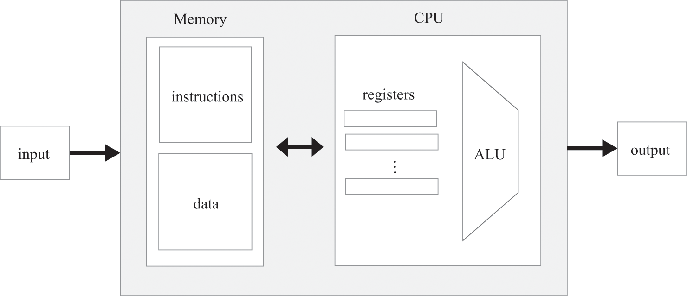
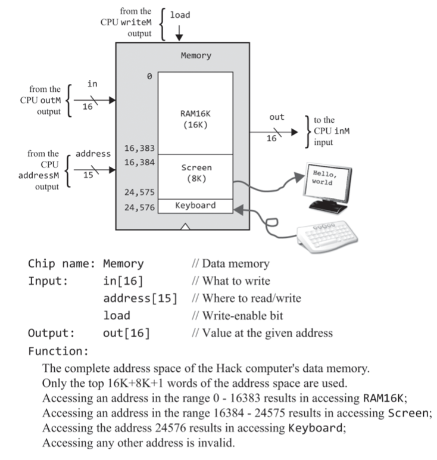
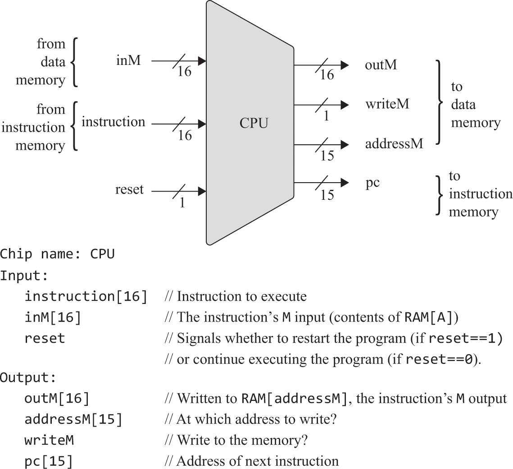
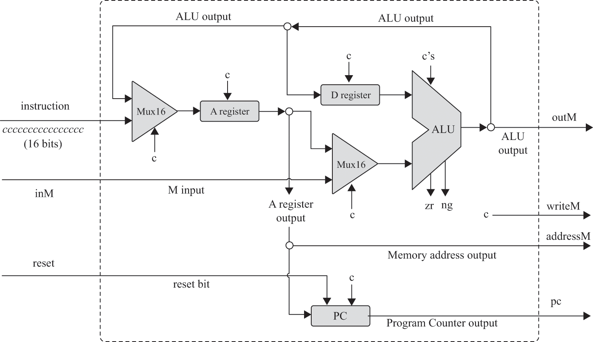

# 05.计算机体系结构

### 概述
```text
冯诺依曼体系结构
```

```text
· 内存。从物理上讲，内存是由可寻址固定大小的寄存器组成的线性序列，每个寄存器都有一个唯一的地址。从逻辑上讲，它的目的是存储数据和存储指令。数据内存和指令内存可以是同一个物理元件也可以是相互独立的，后者被称为哈佛结构，建造更容易，配置更快。
· 程序如何被加载到指令内存中不是关注的焦点，但它必须在程序执行前已经在那。
· CPU的构成：ALU、寄存器组（存储临时值的数据寄存器，存储内存地址的地址寄存器，存储下一条指令地址的程序计数器，存储当前指令的指令寄存器）、控制单元（分解机器指令调动不同芯片工作）
· 获取-执行周期：CPU从指令内存取指令、解码、计算并找出下一条指令的地址。
· I/O：通过把I/O状态映射到内存，使得在CPU看来，操作I/O只是读写指定地址区间的内存。至于如何把状态序列化到内存是商定协议。连接I/O需要两个要素：分配内存映射和安装驱动程序。
```
```text
本例体系组成：CPU（ALU、D、A、PC）、RAM、ROM、SCREEN、KBD。ROM不能动态加载程序。
```

### 习题

⚠️sel的确定，应该是观察出来的。
```text
TODO
```


⚠️控制单元就像ALU一样是通过逻辑控制执行哪个芯片。
```text
· 其中addressM和pc是时序逻辑
· 让我们从关注CPU的指令输入开始。这个16位值表示A指令（当最左边的位为0时）或C指令（当最左边的位为1时）。在A指令的情况下，指令位被解释为应加载到A寄存器中的二进制值。在C指令的情况下，该指令被视为控制位1xxaccccccdddjjj的胶囊，如下所示。A和cccccc位编码指令的comp部分；ddd位编码指令的dst部分；jjj位编码指令的跳转部分。xx位被忽略了。
· 在A指令的情况下，指令的16位将按原样加载到A寄存器中（实际上，这是一个15位值，因为MSB是操作码0）。在C指令的情况下，a位确定ALU输入是从A寄存器值还是从传入的M值输入。cccccc位决定了ALU将计算哪个函数。ddd位决定了哪些寄存器应该接受ALU输出。jjj位用于确定接下来获取哪条指令。
· CPU架构应从指令输入中提取上述控制位，并将其路由到芯片部件目的地，在那里他们指导芯片部件该怎么做才能参与指令的执行。请注意，这些芯片部件中的每一个都已设计用于实现其预期功能。因此，CPU设计主要是以实现此执行模型的方式连接现有芯片。
· 作为执行当前指令的一个副作用，CPU决定并输出接下来要获取和执行的指令的地址。这个子任务的关键元素是程序计数器——CPU芯片的一部分，它的作用是始终存储下一条指令的地址。if jump pc=A else pc++
TODO
```


```text
TODO
```