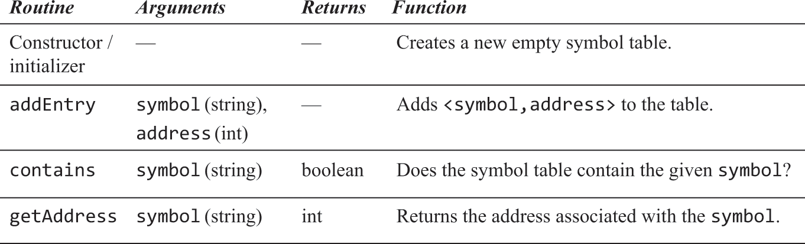

# 汇编器

- 目的：将汇编翻译为机器指令
- 为了支持使用标签代替指令地址，常见解决方案是读取两遍源码，第一遍只将标签及其地址添加到符号表，第二遍根据符号表生成指令
  - 初始化：将所有内置符号及其机器码写到符号表
  - 第一次读取：逐行读源码，从0开始记录A/C指令地址。每当遇到A/C指令时地址才加1。遇到L指令时，将下一条A/C指令地址作为其地址添加到符号表
  - 第二次读取：逐行读源码，若为A指令，且符号表中不存在该符号，则表示这是变量定义，所有变量按出现顺序依次绑定到[RAM[16], ++)，
将该符号及其RAM地址记录到符号表。在将A指令翻译为机器指令时，使用其在符号表中记录的地址而不是符号本身。若为C指令，将其各组成部分翻译为机器码后
按[机器语言语法图](./img/04/语法.png)拼接即可

## 习题

### 分解源码

 

[Parser.java](./Assembler/src/com/example/assembler/Parser.java)

### 生成机器码

 

[Code.java](./Assembler/src/com/example/assembler/Code.java)

### 符号表

 

[SymbolTable.java](./Assembler/src/com/example/assembler/SymbolTable.java)

### 生成.hack

- 方法调用即goto至某标签(汇编地址)继续执行，若其位于另一汇编文件中，则无法跳转，要将它们转成一个hack文件，使用统一的地址索引，这种方式被称为“静态链接”。
- 动态链接：程序员需写明引用了的可执行文件的地址，链接器在程序被加载到内存后检查这些声明，并将被引用的可执行文件也加载到内存并执行链接过程

[Assembler.java](./Assembler/src/com/example/assembler/Assembler.java)
