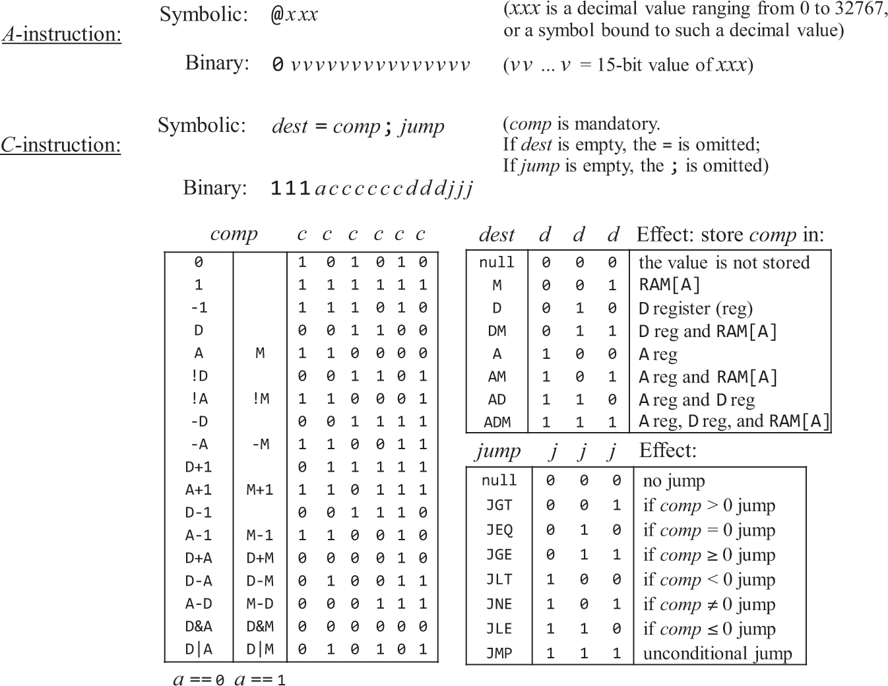
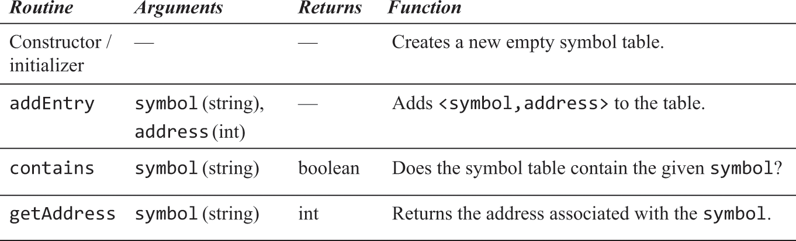

# 06.汇编器

### 概述
```text
目的：将构造的易于编写的汇编语法翻译为可被计算机执行的机器指令。
```
```text
· 为了支持使用标签代替指令地址，常见解决方案是读取两遍汇编源码，第一遍将标签添加到符号表且不生成任何指令，第二遍根据符号表生成指令。
    · 初始化：将所有内置符号及其数字值写到符号表
    · 第一次读取：逐行读取汇编源码，从0开始记录指令地址。每当遇到A/C指令时地址才+。遇到L指令时，将这个符号与下一个的A/C指令地址绑定并添加到符号表。
    · 第二次读取：逐行读取汇编源码，如果遇到了引用符号的A指令，查找符号表用数字值代替这个符号后翻译为机器指令。如果符号表中不存在，那表示它是一个变量定义，本例中的变量都被依次绑定到[RAM[16], ++)，将其和内存地址绑定并添加到符号表后翻译为机器指令。如果遇到C指令，将各部分翻译为二进制串和111前缀按顺序合并为机器指令。
```

<br>

本例机器语言的语法设计图


<br>
<br>

### 习题
<hr>
<br>
<br>

汇编器模块：解析器。用于分解汇编源码。


<br>
<br>
<hr>
<br>
<br>

汇编器模块：代码模块。用于将汇编源码转为对应的二进制码。


<br>
<br>
<hr>
<br>
<br>

汇编器模块：符号表。用于支持处理符号。


<br>
<br>
<hr>
<br>
<br>

汇编器：按照概述的处理方式，在asm文件统计目录生成一个hack文件