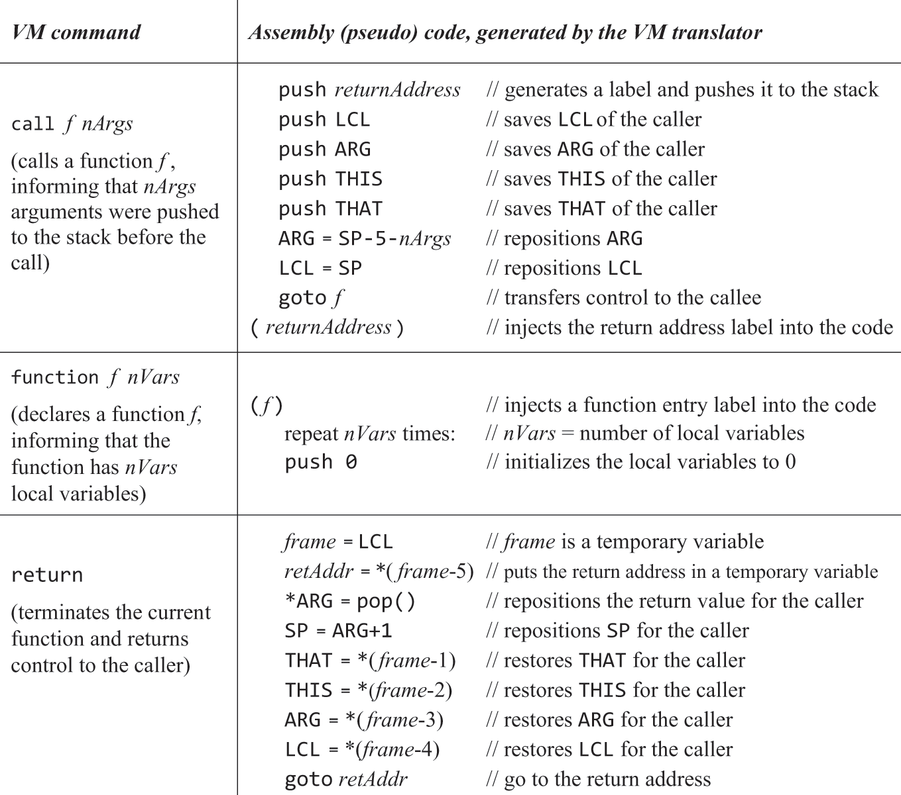
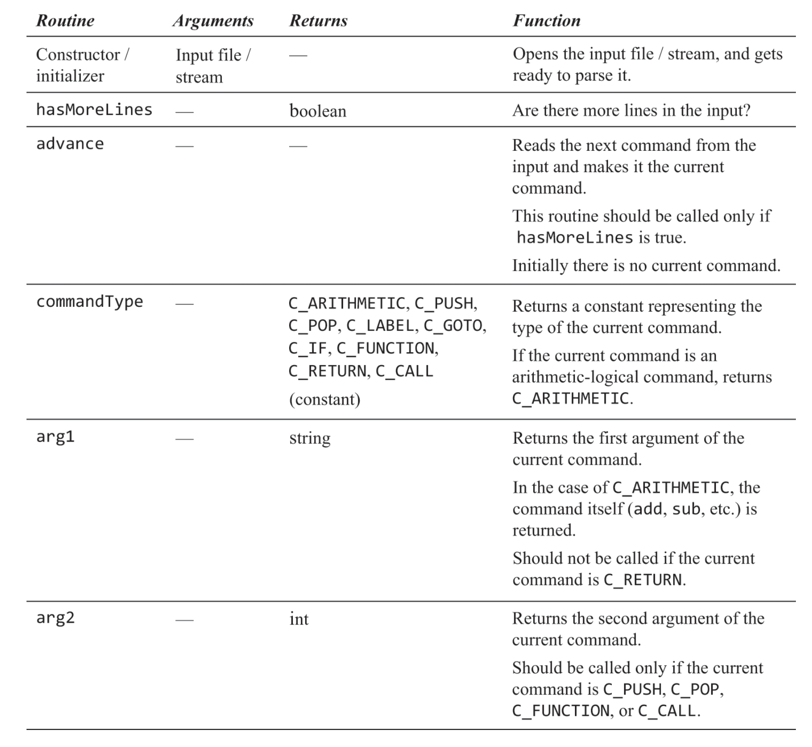
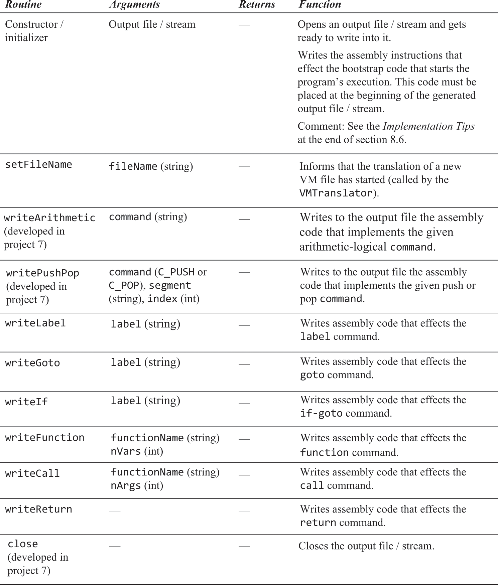

# 07.08.Jack语言——虚拟机

### 概述
```text
· 本例的Jack是面向对象的语言，像Java一样采用运行于VM（虚拟机）的方式。先被一个编译器编译为运行于VM的VM语言，再由VM翻译器将其翻译为汇编。这种方式只需编译一次就可借助不同硬件架构的VM运行在不同硬件架构上。其他语言也可以选择编译为特定VM的中间代码，以借助其VM实现跨平台。虽然这种方式生成的汇编命令相比之下更多。但好处除了一次编译到处运行外，还可以通过审查中间代码来发现恶意代码。
· 目的：实现VM翻译器（VMTranslator），用以将Jack的中间代码翻译为Hack汇编。重要的是了解Jack的VM设计和语言规范，以及了解如何在汇编中表达 栈、分支、函数调用。
· 栈：这种数据结构可以很好的表达函数运行状态和调用链，用它来存储那些随函数生亡而生亡的数据。不符合此描述的无需也不能放入栈，比如静态变量。而且在函数之中不能直接跳转（goto）到函数外，再次操作栈时会导致混乱。
```

### VM内存模型
```text
· 为VM构想一个内存模型来代替真实的RAM和寄存器，然后据此模型设计指令（VM语言）。所以“中间语言运行于VM”是虚构的，因为这个模型并没有真正的硬件实现，本例的虚拟内存模型分如下几个段。中间语言没有变量，全部用"内存段 非负索引"表示，索引由编译器负责生成，VM翻译器实现无需关心。
	local		实例方法局部变量
	argument	实例方法参数
	this
	that
	temp
	static		类静态变量
	pointer		只有两个索引：0、1，pointer 0指代用于保存this段基址的存储器，而1同理指代that，在编译器实现时详述
	constant	常量标志。将常量3写入vm语言的唯一方式是push constant 3，3不是内存段索引，而是常量3。constant也不是内存段，而是给编译器看的关键字，所以constant不能是pop的操作对象，它没有内存位置
```

### VM语言规范
```text
· 只能通过唯一的栈操作数据（运算、函数传参/返回值），通过push/pop将数据在栈和内存段间转移："push/pop 内存段名称 非负索引"
· 只有一种数据类型：有符号16位整数
· 所有运算无需指定操作数，因为都是从栈里取，第一个操作数相较第二个位于栈中更底层的位置（先入栈）。
	add		加
	sub		减
	neg		取负
	eq		相等
	gt		大于
	lt		小于
	and		与
	or		或
	not		非
· 有条件跳转：if-goto：弹出栈顶元素，当其非false时发生跳转
· 无条件跳转：goto
· 调用自定义函数使用"call 函数名 参数个数"，标记函数执行结束使用return，编译器以此为标记进行翻译。
· main函数是Jack程序的入口点，当存在多个vm文件时，必须存在一个名为Main的vm文件，其中必须存在一个名为main的函数。
· 编译器生成的vm文件的函数名命名方式为“文件名.函数名 局部变量个数”，例如：Main.main，以此做到全局唯一。
```
程序示例（实际中vm语言没有变量名，都应被转为 "内存段 非负索引"）


### VM针对Hack平台的标准映射
```text
· 虽然只要实现了VM抽象即可，但VM架构师通常会为不同的硬件平台发布实现指南（“标准映射”），Hack汇编的内置符号充当了寄存器的角色，也可叫虚拟寄存器。在函数调用发生时应当压栈保护如下寄存器：LCL、ARG、THIS、THAT，使用术语帧(frame)表示这些需要被压栈保护的寄存器的集合。
· true/false分别用-1/0表示
	虚拟寄存器SP		用于保存VM中栈顶的地址（栈顶指针）
	虚拟寄存器LCL		用于保存VM中local内存段基址
	虚拟寄存器ARG		用于保存VM中argument内存段基址
	虚拟寄存器THIS		用于保存VM中this内存段基址，VM中对pointer 0操作等同于操作THIS寄存器，1同理于THAT。所以pointer 0被绑定为RAM[3]，pointer 1被绑定为RAM4]
	虚拟寄存器THAT		用于保存VM中that内存段基址
	RAM[5~12]		用作VM中temp内存段，将5绑定位temp段基址，它不随函数切换而改变
	虚拟寄存器R13..R15	VM翻译器工作过程中如果需要使用变量，可以使用这几个虚拟寄存器
	RAM[16~255]		在汇编器中约定所有变量都被绑定到RAM[16, ++]，那么可以将vm语言的静态变量用汇编变量表示。vm中的static i会被翻译为汇编的@文件名.i，这样能保证全局唯一
	RAM[256~2047]		用来做vm中的栈。采用从低地址向高地址增长的方式。
```

### Hack汇编实现栈操作
```text
举例（push 1）：RAM[SP++] = 1
	@1
	D=A
	@SP
	A=M
	M=D
	@SP
	M=M+1
```

### Hack汇编实现分支
```text
举例：RAM[SP] = RAM[SP] > 0 ? 1 : -1
	@SP
	A=M
	@BIGGER_ZERO
	M;JGT
	M=-1
	@AFTER_COMPARE
	0;JMP
(BIGGER_ZERO)
	M=1
(AFTER_COMPARE)
	…
```

### Hack汇编实现VM语言的函数调用
· 返回地址：在call指令下一行生成一个标签，将标签地址作为被call的函数执行结束后应返回到的地址，压栈供其跳转使用。<br>
· 在即将调用函数之前，内存应当是如下状态（local、argument、this、that的压栈顺序无关紧要）。local基址=栈顶，argument基址=第一个参数的地址。<br>
<br>
· 函数要做的第一件事是在栈上初始化局部变量，留出空间。如果Jack语法不自动初始化，那么就无须初始化。否则，要么在编译器中生成初始化代码，要么在这里初始化。<br>
· 在函数执行结束后，local、argument、this、that全被恢复为旧值，y处存放函数返回值，栈顶=y+1<br>
· 可实现这种描述的伪代码如下所示（注意无参调用时ARG指向存返回的位置，在将返回值放入*ARG前要先把返回地址拿出来）<br>


<br>
<br>

### 习题（代码位于/VMTranslator
<hr>

以后要用Jack实现的操作系统的首个进程是Sys.ini，在08章最后两个测试例子执行时，应在asm文件一开始生成如下伪代码的汇编
```text
	SP=256
	call Sys.init
(某标签)
	goto 某标签
```
<hr>
<br>
<br>

VMTranslator模块：Parser，用于解析VM语言


<br>
<br>
<hr>
<br>
<br>

VMTranslator模块：CodeWriter，用于将解析完的VM语言转为Hack汇编并写入asm文件
