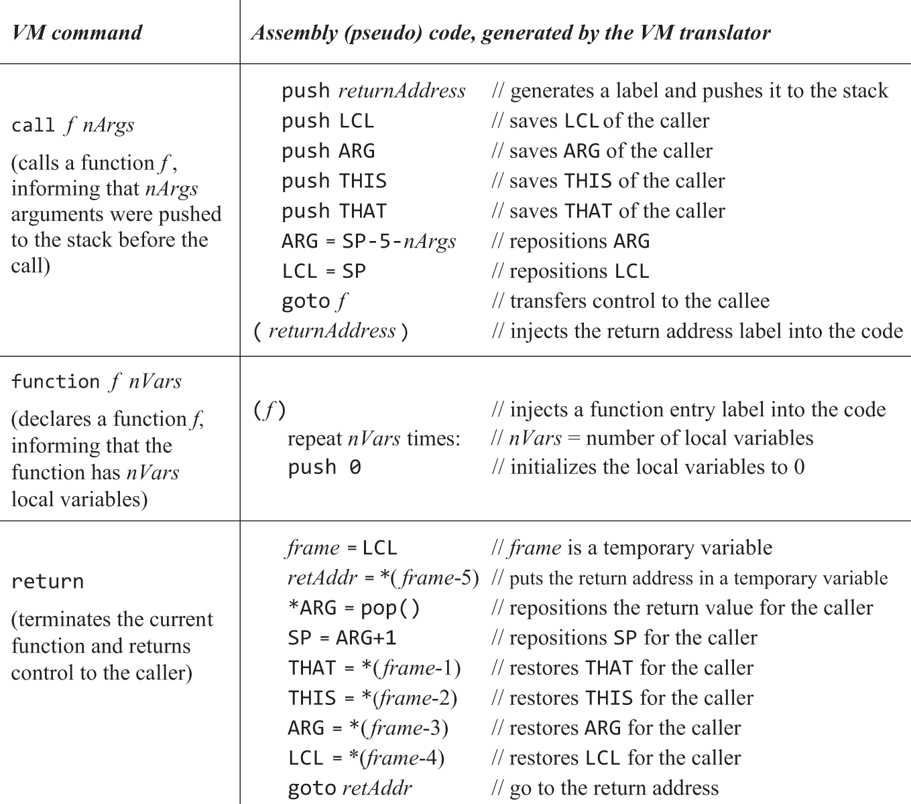
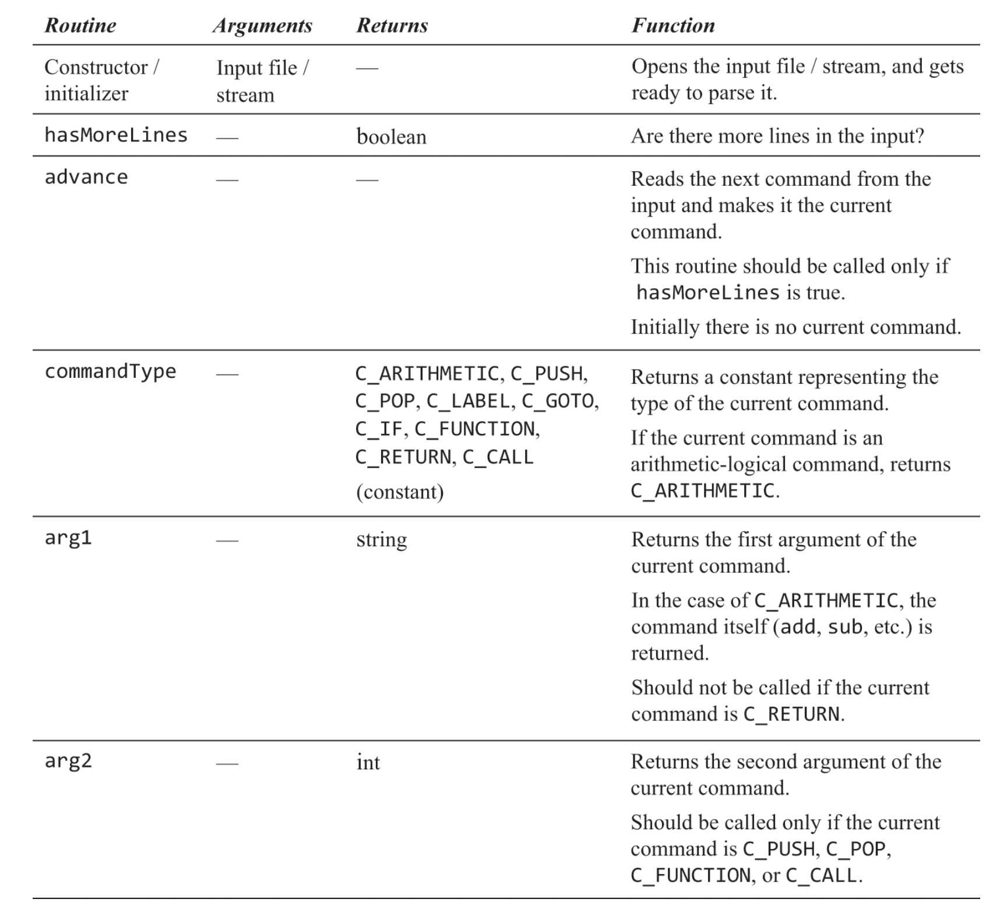
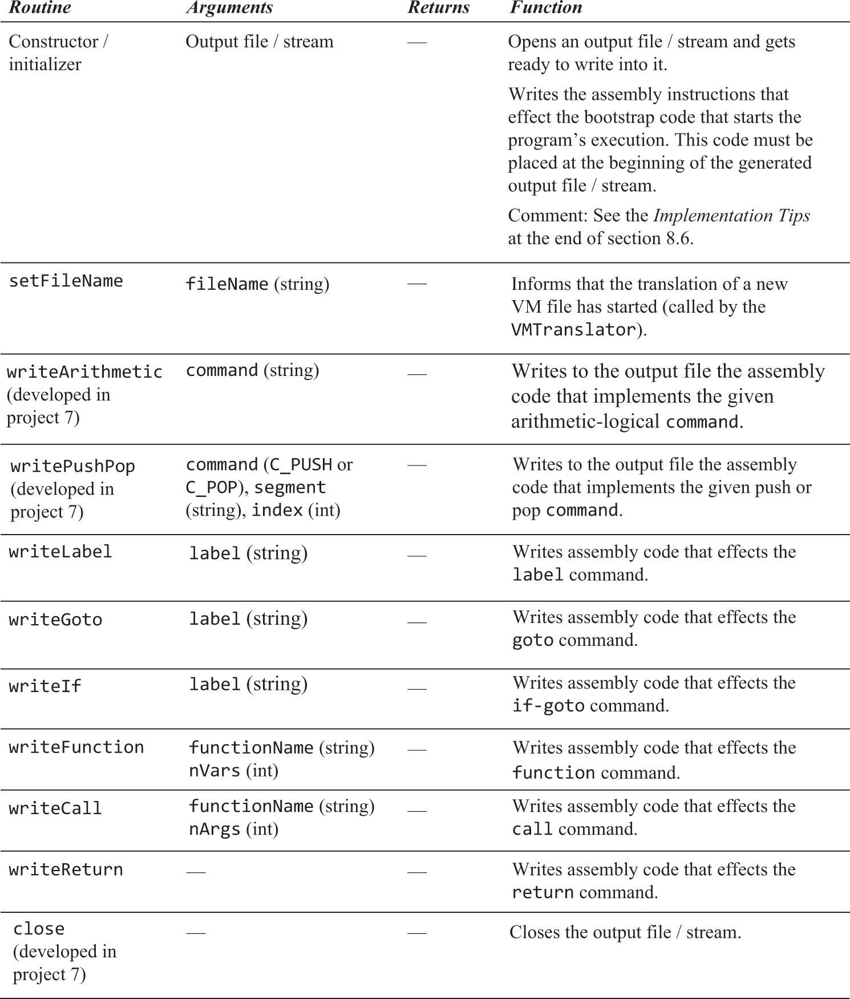

# 虚拟机

- Jack和Java一样面向对象且运行于虚拟机上，Jack源码会被Jack编译器编译为虚拟机语言，虚拟机翻译器再把虚拟机语言翻译为Hack汇编
- 目的：实现虚拟机翻译器VMTranslator，重要的是了解虚拟机设计和虚拟机指令规范，及如何在机器指令中表达栈、分支、函数调用
- 栈：这种数据结构可以很好地表达函数运行状态和调用链，用它来存储那些随函数生亡而生亡的数据。不符合此描述的无需也不能放入栈，如静态变量。
而且在函数中不能直接goto到函数外，会导致栈混乱

### VM内存模型

为VM构想一个内存模型来代替真实的RAM和寄存器，然后据此模型设计指令（VM语言）。VM语言没有变量，全部用"内存段 偏移量"表示，偏移量由编译器负责生成，
VM翻译器无需关心。Jack的虚拟内存模型分如下几个内存段：

- local 实例方法局部变量
- argument 实例方法参数
- this
- that
- temp
- static 类静态变量
- pointer 只有两个偏移空间：0、1，pointer 0指代用于保存this段基址的存储器，而1同理指代that的，在编译器实现时详述
- constant 常量标志。将常量3写入vm语言的唯一方式是push constant 3，3不是内存段偏移量，而是常量3。constant也不是内存段，
而是给编译器看的关键字，所以constant不能是pop的操作对象，它没有内存位置

### VM语言规范

- 只能通过唯一的栈操作数据（运算、函数传参/返回值），通过push/pop将数据在栈和内存段间转移：“push/pop 内存段名称 偏移量”
- 只有一种数据类型：有符号16位整数
- 所有运算无需指定操作数，因为都是从栈里取，第一个操作数相较第二个位于栈中更底层的位置（先入栈）
  - add 加
  - sub 减
  - neg 取负
  - eq 相等
  - gt 大于
  - lt 小于
  - and 与
  - or 或
  - not 非
- 有条件跳转：if-goto：弹出栈顶元素，当其非false时发生跳转
- 无条件跳转：goto
- 调用自定义函数使用"call 函数名 参数个数"，标记函数执行结束使用return，翻译器以此为标记进行翻译
- main函数是Jack程序的入口点。当存在多个vm文件时，必须存在一个名为Main的vm文件，且其中必须存在一个名为main的函数
- 编译器生成的vm指令中的函数名命名方式为“vm文件名.函数名 局部变量个数”，例如：Main.main，以此做到全局唯一

#### 示例

实际上vm语言没有变量名，都应被转为 “内存段 偏移量”


<br>

### VM对Hack平台的标准映射

frame指代一个单元或结构，根据上下文不同其具体内容也不同。例如虚拟内存中平分内存块，这些块可被成为Page Frame；
随函数调用和返回而产生和销毁的栈空间可被成为Stack Frame；而此处的frame表示如下集合：返回地址、LCL、ARG、THIS、THAT

虽然只要实现了VM抽象即可，但VM架构师通常会为不同的硬件平台发布实现指南(标准映射)，Hack汇编的内置符号充当了寄存器的角色，也可叫虚拟寄存器。
在函数调用发生时应当压栈保护如下寄存器：LCL、ARG、THIS、THAT

- true/false分别用-1/0表示
- 虚拟寄存器SP 用于保存VM中栈顶的地址（栈顶指针）
- 虚拟寄存器LCL 用于保存VM中local内存段基址
- 虚拟寄存器ARG 用于保存VM中argument内存段基址
- 虚拟寄存器THIS 用于保存VM中this内存段基址，VM中对pointer 0操作等同于操作THIS寄存器，1同理于THAT。
所以pointer 0被绑定为 RAM[3]，pointer 1被绑定为RAM[4]
- 虚拟寄存器THAT 用于保存VM中that内存段基址
- RAM[5~12] 用作VM中temp内存段，将5绑定位temp段基址，它不随函数切换而改变
- 虚拟寄存器R13..R15 VM翻译器工作过程中如果需要使用变量，可以使用这几个虚拟寄存器
- RAM[16~255] 在汇编器中约定所有变量都被绑定到RAM[16, ++]，那么可以将vm语言的静态变量用汇编变量表示。vm中的static i会被翻译为 汇编的@文件名.i，这样能保证全局唯一
- RAM[256~2047] 用来做vm中的栈。采用从低地址向高地址增长的方式

### Hack汇编实现栈

push 1，即RAM[SP++] = 1

```text
    @1
    D=A
    @SP
    A=M
    M=D
    @SP
    M=M+1
```

### Hack汇编实现分支

RAM[SP] = RAM[SP] > 0 ? 1 : -1

```text
    @SP
    A=M
    @BIGGER_ZERO
    M;JGT
    M=-1
    @AFTER_COMPARE
    0;JMP
(BIGGER_ZERO)
    M=1
(AFTER_COMPARE)
    …
```

### Hack汇编实现函数调用

- 返回地址：在call指令下一行生成一个标签，将该标签地址压栈作为函数执行结束后应返回到的地址
- 在调用函数前，内存应是如下状态（local、argument、this、that的压栈顺序无关紧要）。local基址(x)=栈顶，argument基址(y)=第一个参数的地址


<br>

- 调用函数的第一件事是在栈上初始化局部变量，留出空间。如果Jack语法不自动初始化，那么就无须初始化。否则，要么在编译器中生成初始化代码，要么在翻译器生成
- 在函数执行结束后，local、argument、this、that全被恢复为旧值，y处存放函数返回值，栈顶=y+1
- 实现上述描述的伪代码如下（注意无参调用时ARG指向存返回的位置，在将返回值放入*ARG前要先把返回地址拿出来）


<br>

## 习题

以后要用Jack实现的操作系统的首个进程是Sys.ini，在08章最后两个测试例子执行时，应在asm文件一开始生成如下伪代码的汇编

```text
    SP=256
    call Sys.init
(某标签)
    goto 某标签
```

### 解析VM指令


<br>

[Parser.java](./VMTranslator/src/com/example/vmtranslator/Parser.java)

### 生成.asm


<br>

[CodeWriter.java](./VMTranslator/src/com/example/vmtranslator/CodeWriter.java)
