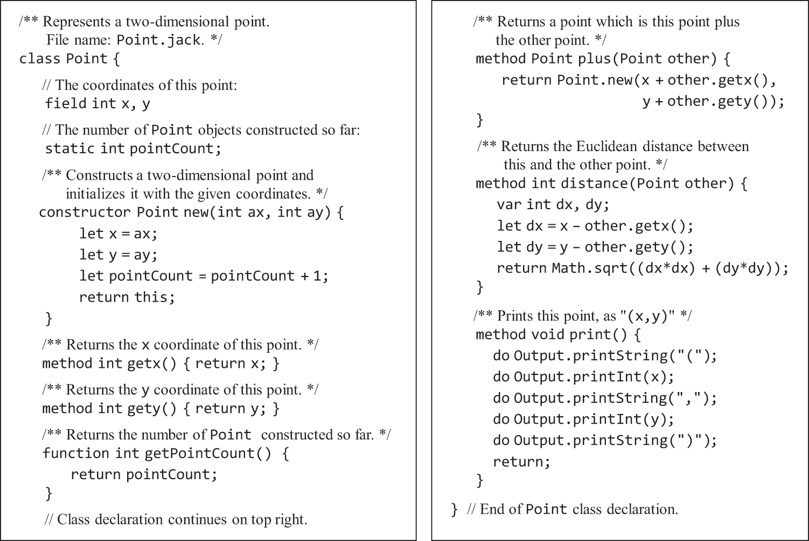
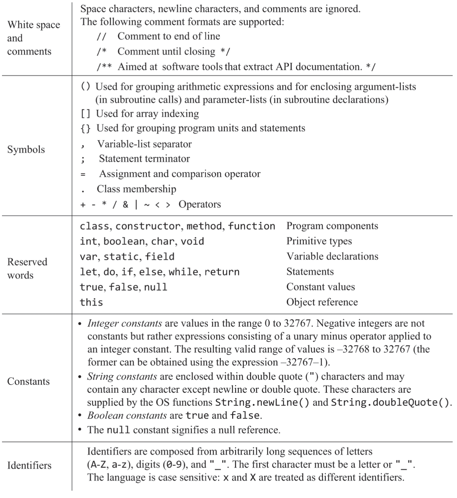

# 高级语言

- 程序入口点是Main#main()

```text
class Main {
    function void main() {
        // 程序入口;
    }
}
```

- 构造函数constructor，实例方法method，静态函数function
- 所有方法/函数必须以return结束，构造函数return this
- 赋值和Java一样。对于a=b，就是把b的值拷贝给a，不论其是基本类型还是对象引用
- 一个文件只能一个class，class名必须与文件名同。⚠️这个规定应该是方便VM翻译器的，翻译后的vm中没有可以体现类名的东西，只能取文件名

**为方便编译器实现**

- 变量声明得在方法/函数之前
- 类型转换无需显式声明
- 运算符优先级需要手工写括号，一律从左到右运算
- 没有垃圾回收，需要调用Memory.deAlloc(引用)来回收内存
- 没有方法重载
- 静态函数必须用类名调用
- 字段一律私有，方法/函数一律公有

**示例**


<br>

**支持的符号**


<br>
