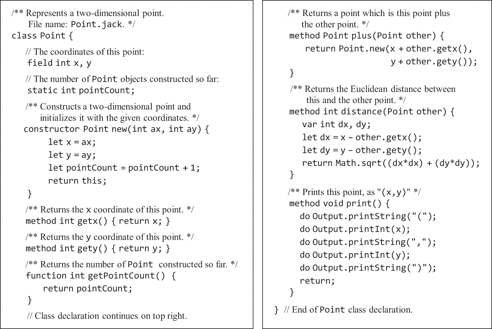
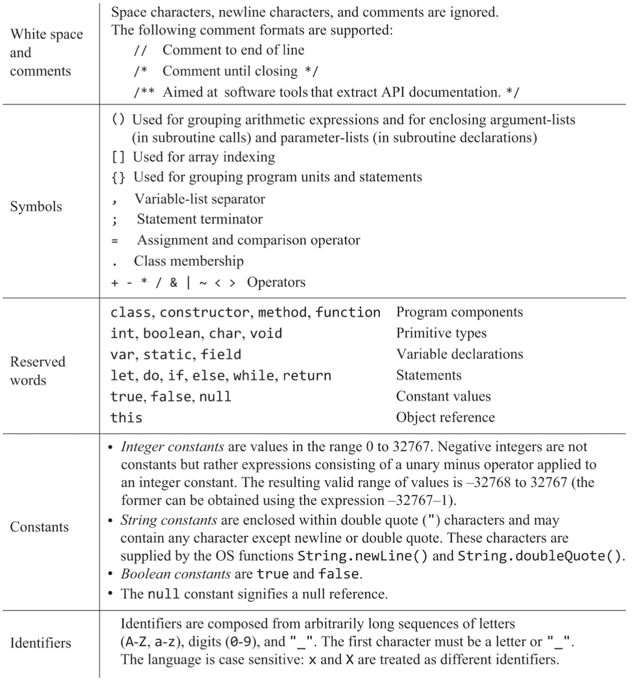

# 09.Jack语言——语法

### 概述
```text
· 程序入口点是Main.main
    class Main {
        function void main() {
            // 程序入口;
        }
    }
· 构造函数constructor，实例方法method，静态函数function
· 所有方法/函数必须以return结束，构造函数return this
· 赋值采用Java一样的“值传递”，⚠️不知道有没有其他传递方法，应该没有吧，难道不都是把变量的值拷贝给另一个吗
· 一个文件只能一个class，class名必须与文件名同。⚠️这个规定应该是给VM翻译器用的，翻译后的vm中没有可以体现类名的东西，只能取文件名。
```
#### 为了编译器实现方便
```text
· 变量声明得在方法/函数之前
· 类型转换无需显式声明
· 运算符优先级需要手工写括号，一律从左到右运算
· 没有垃圾回收，需要调用Memory.deAlloc(引用)来回收内存
· 没有方法重载
· 静态函数必须用类名调用
· 字段一律私有，方法/函数一律公有
```

<br>
<br>
<hr>
<br>
<br>

### 示例

#### 支持的符号
