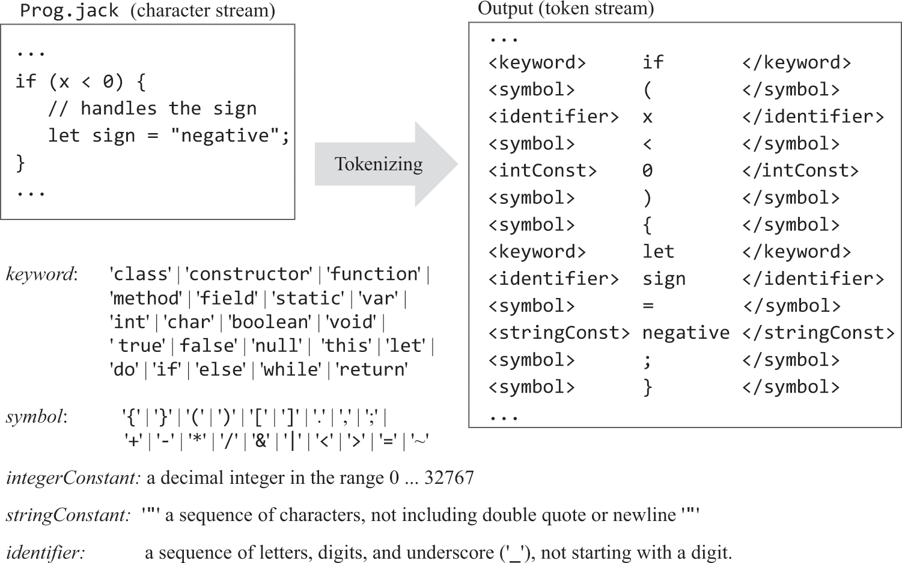
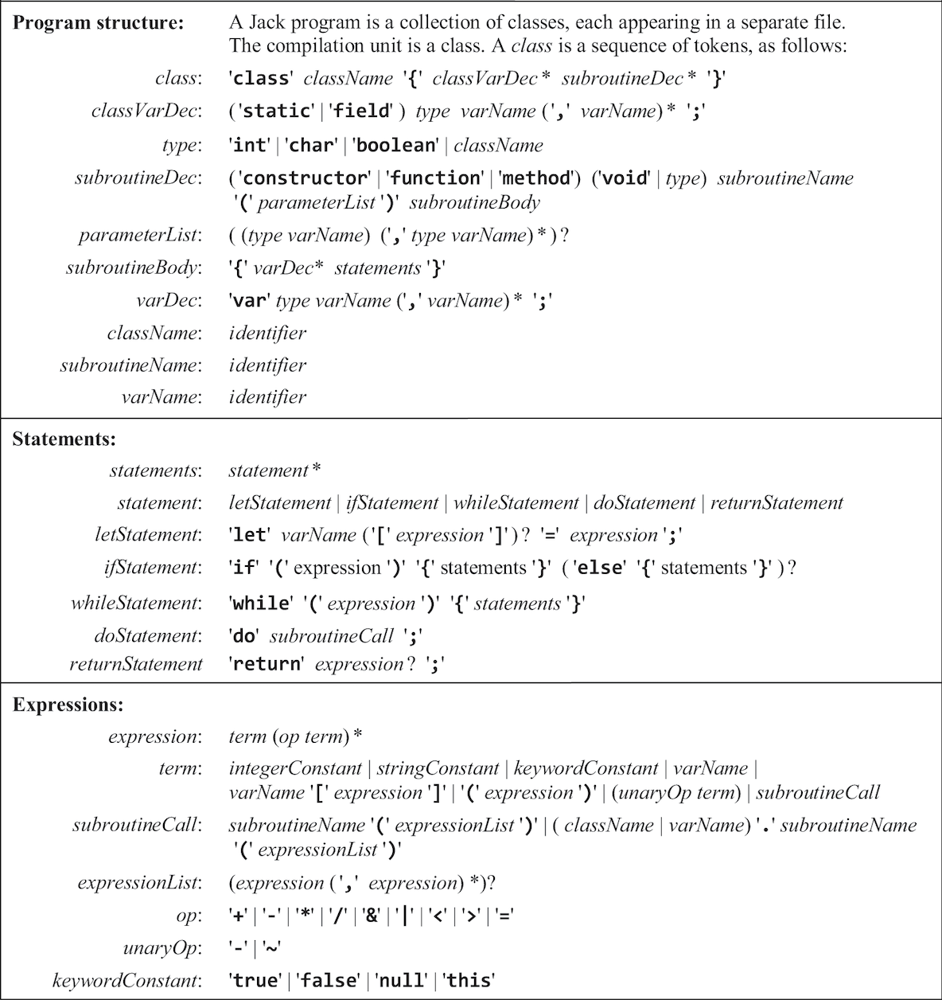
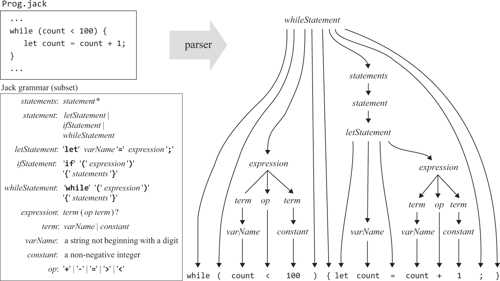

# 10.Jack语言——编译器（语法分析）

### 概述
```text
· 通过制定“标记”组合方式来表示什么是正确的语法，这被称为“句法模式”。
· 本例通过“标记化、解析”两个步骤完成Jack编译器的语法分析部分，并通过输出xml来验证是否按照预期进行。
· “标记化”步骤即将源码拆分为原子并打上“标记”，“解析”步骤即判断这些“标记”组合是否符合“句法模式”。
```

### 标记化
```text
· 将源码（除注释和空白）拆分为原子，并打上标记。
· “标记化”步骤产生的xml作为“解析”步骤的输入。
· 注意<, >, ", &在xml中需要被转义为&lt;, &gt;, &quot;, &amp;。
```



### 句法模式
```text
· 本例的句法模式（class, classVarDec, subroutine, parameterList, subroutineBody, varDec, statements, letStatement, ifStatement, whileStatement, doStatement, returnStatement, expression, term, expressionList）及对模式中|、*等符号的说明如下。
· 本例的声明、赋值都需要专用关键字，从左至右解析，只需根据前一个标记便可知道它应匹配哪个句法模式，这被称为LL(1)。
```



### 解析
```text
· 需要将给定的标记组合和句法模式对应起来才能验证标记是否符合句法模式，这种对应关系可被“解析树”结构表达，不能构建解析树的标记组合，被视为语法错误。
· 本例的语法是LL(1)的（subroutineCall是例外，需要用前两个标记判断），所以解析器很适合使用“递归下降”算法实现。
```

##### 输出结构
```xml
<句法模式>
	<标记>值</标记>
	…
	<句法模式>
		<标记>值</标记>
		…
	</句法模式>
	…
</句法模式>
…
```


<br>
<br>

### 习题（代码位于/JackAnalyzer
<hr>
<br>
<br>

JackAnalyzer模块：JackTokenizer（标记化


<br>
<br>
<hr>
<br>
<br>

JackAnalyzer模块：CompilationEngine（解析器
