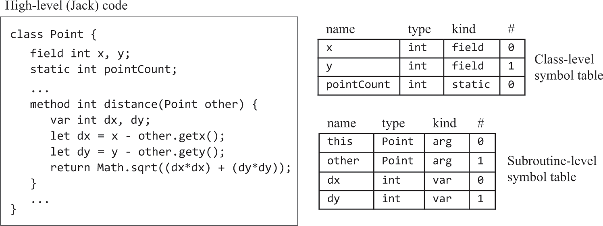
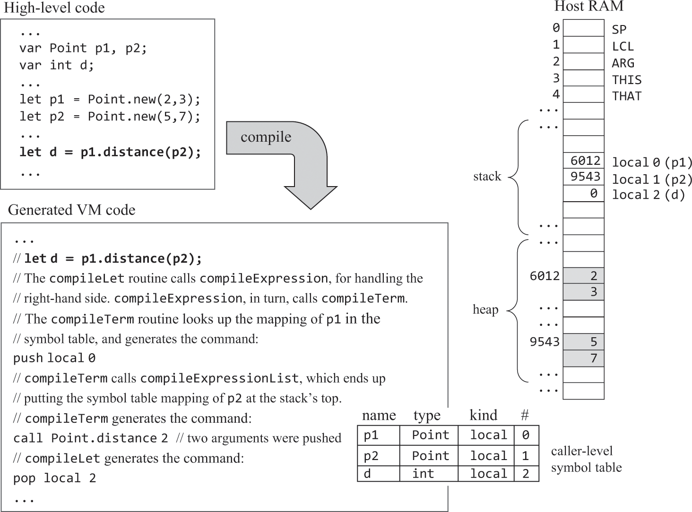
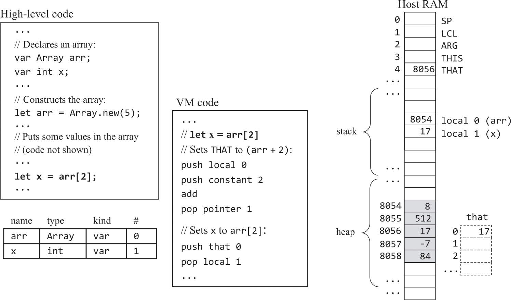

# 编译器（生成VM指令）

### 变量

#### 生命周期

这里无需处理生命周期，已在07和08章的VM翻译器中实现了：

- 静态（类级）：和代码同生死。在汇编中以"@CLASS名.变量名"方式作为汇编变量出现
- 字段（实例级）：和对象同生死。构造函数为对象开辟空间就是为它所有的字段开辟空间
- 局部变量（方法级）：和方法同生死。汇编中在实际的函数跳转发生前，由调用者负责为被调用者的局部变量开辟空间，并将LCL修改到正确的位置

#### 符号表

- 就像汇编器用符号表记录vm变量和RAM地址的关系一样，这里也需要用符号表记录Jack变量和VM内存地址的关系
- 但高级语言中在不同作用域/生命周期（static/field、var）下可存在同名变量，Jack编译器使用两个符号表（类级、局部级）分别存储，
这两个表分别在每次遇到 “class”、“constructor/method/funciton”时被初始化。method需要初始化一个this条目，在下面叙述


<br>

#### 作用域

编译器应当先从局部符号表取值，没有的话再检查类级符号表，这被称为“内部作用域隐藏外部作用域”。Jack只有这两种作用域级别，
对于其他支持无限嵌套作用域的语言，可以使用链表形式实现符号表。

### 表达式

需要把运算符的中缀表示转为后缀表示（包括函数调用），所以要修改上一章的CompilationEngine.compileExpression()，使其以后缀方式输出表达式。


<br>

### 字符串

Jack标准库封装了String类（标准库在12章中实现，现在只需假定已经存在）用以处理字符串，字符串常量写法是语法糖。
这个过程和大多数高级语言的处理相似，但Jack不提供垃圾回收。例如：x = “abc”; 编译器将按如下代码处理：

```text
x = String.new();
x = x.appendChar(‘a’);
x = x.appendChar(‘b’);
x = x.appendChar(‘c’);
```

#### 语句

**return，如return x + y;**

先翻译x + y，其值自然会出现在栈顶，然后直接生成return即可。

**let，如let x = y + 1;**

先翻译y + 1，结果位于栈顶，再pop到x在符号表中绑定的vm内存地址。数组处理在下面叙述。

**do，如do className.functionName(…)**

do调用的方法不一定有返回值，如何知道方法是否有返回值？不能，那就让所有方法都必须有返回值(void返回0)，在do完成后抛弃返回值：pop temp 0

**if、while**

在vm语言中把它们转成用goto、if-goto表达，要先处理条件表达式，好让其值位于栈顶作为跳转判断条件。

```text
* if示例
    …
    条件表达式的boolean值
    (bool取反)
    if-goto 失败标签
    if成立的逻辑
    goto 后续标签
失败标签
    [else的逻辑]
后续标签
    …

* while示例
    …
while开始标签
    条件表达式的boolean值
    (bool取反)
    if-goto 后续标签
    while成立的逻辑
    goto while开始标签
后续标签
    …

* 布尔取反
    书中设计的true/false分别用-1/0表示，在图8.1/图11.6中分别使用了neg/not试图互换true/false，但我觉得错误，因为按照定义(图7.5)，neg只是
将符号互换，而not是按位取反。所以Jack中的"非"不能直接用vm表示，vm中缺乏这样的直接表达。而在将Jack的if/while/~翻译成vm时都需要布尔取反，如果
不修改vm中not的定义，就只能让Jack编译器生成vm代码把-1和0互换：（虽然随书工具的VMEmulator可以将not解释为true/false互换，但我自己做的不可以
呀，而且这不符合vm中not的定义）
    …
    // 布尔值已位于栈顶
    if-goto TO_FALSE
    push constant 1
    neg
    goto NEXT
TO_FALSE
    push constant 0
NEXT
    …
```

### 对象

对象被存储在堆中一块儿单独为其开辟的空间上，为对象开辟空间就是为其所有字段开辟空间。因为字段的生死是随对象的，所以不能存在栈上，
栈这种结构是为了方法调用，只存方法运行状态。通过将基址存到this，后续使用"this 偏移量"引用这些字段。
下面描述的数组需要将元素地址存到that，然后通过that 0就可操作元素本身，这就是为啥要把this、that做成强绑定pointer 0/1，
因为这样就可以做成指针，对that 0的访问就等同于*(pointer 1)。


<br>

#### 访问控制

无。Jack中的变量/字段全部私有，函数/方法全部公有。

#### 构造函数

和其他方法/函数的区别在于，在正式翻译方法指令前，要先按如下示例开辟空间并将基址赋值this。
构造函数末尾必须 return this，即push pointer 0; return;


<br>

#### 实例方法

在A#fun1()中调用B#fun2(int)需要b.fun2(0)；在B#fun1()中调用B#fun2(int)可以只需fun2(0)，编译器会把后者当作this.fun2(0)。
方法在内存中是一堆指令集，只有一份，实例有多个。实例方法操作实例数据时，偏移量是已知的，但需要明确哪个实例，即实例地址必须通过参数的方式传入实例方法。
在Jack中和Java一样，通过将其作为隐式的第一个参数传入实例方法。

Jack不支持继承，继承需要虚拟机的运行时支持，因为设s extends f，当出现f.fun()时，编译器无法知道应该调用s.fun()还是f.fun()。


<br>

既然实例方法参数列表的第一个永远是this，那么编译器需要为实例方法的符号表初始化首条记录：<this 类名 arg 0>。真正编译实例方法指令前，
应先按如下示例将arg 0赋给this（pointer 0）。


<br>

#### 数组

编译器通过Array类实现数组语义，那么数组引用存的是数组在堆中的基址，将数组引用的值与索引相加得到一个内存地址，这个内存地址（存在that指针上）
上的值（通过that 0获得）就是数组元素的值。


<br>

如果是let arr[x] = y呢？THAT只有一个，它会被重写，上述方式无法工作。采用如下方式实现：

```text
	push arr
	(compileExpression)
	add
	// 目标地址已位于栈顶
	(compileExpression)
	// 源值已位于栈顶，暂存到temp
	pop temp 0
	// 将目标地址移至that
	pop pointer 1
	// 将源值写到RAM[目标地址]上
	push temp 0
	pop that 0
```

## 习题

### 标记化

同第10章

### 符号表


<br>

[SymbolTable.java](./JackCompiler/src/com/example/SymbolTable.java)

### 生成指令


<br>

[VMWriter.java](./JackCompiler/src/com/example/VMWriter.java)

### 生成.vm

API同第10章，但这里生成的是vm文件而不是xml
