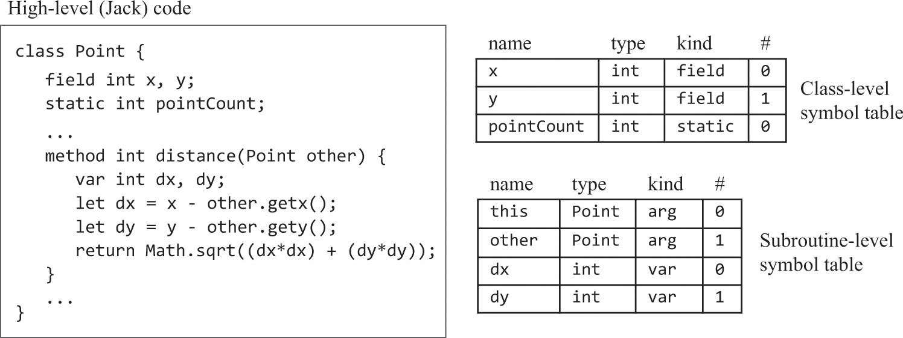
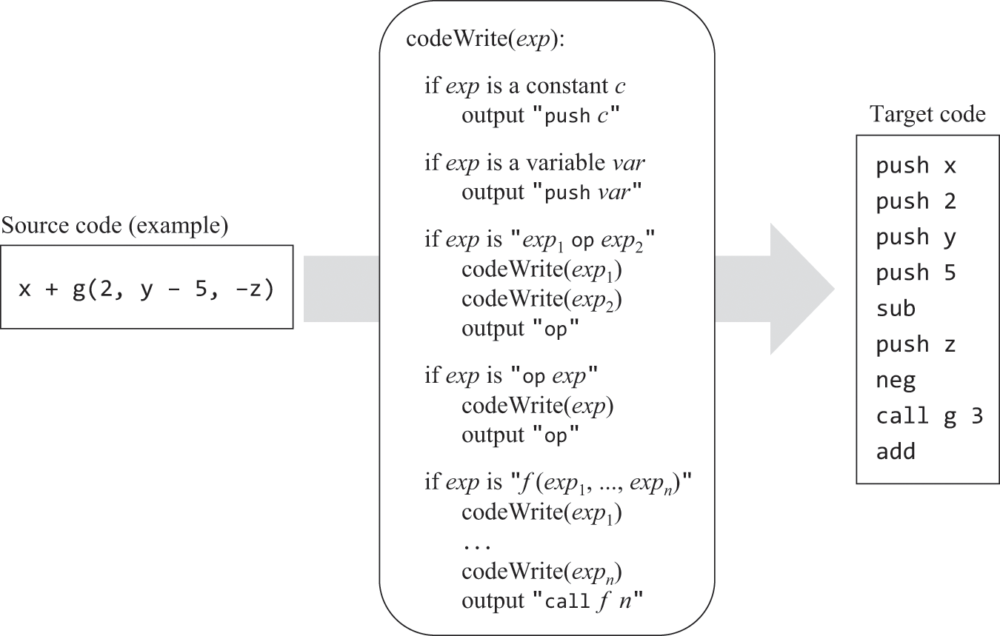
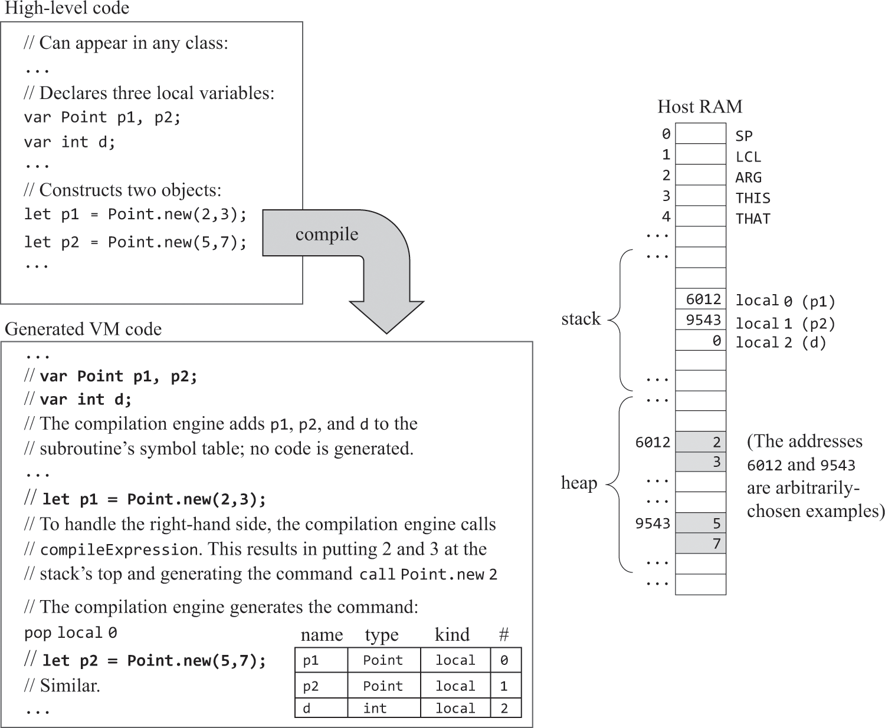
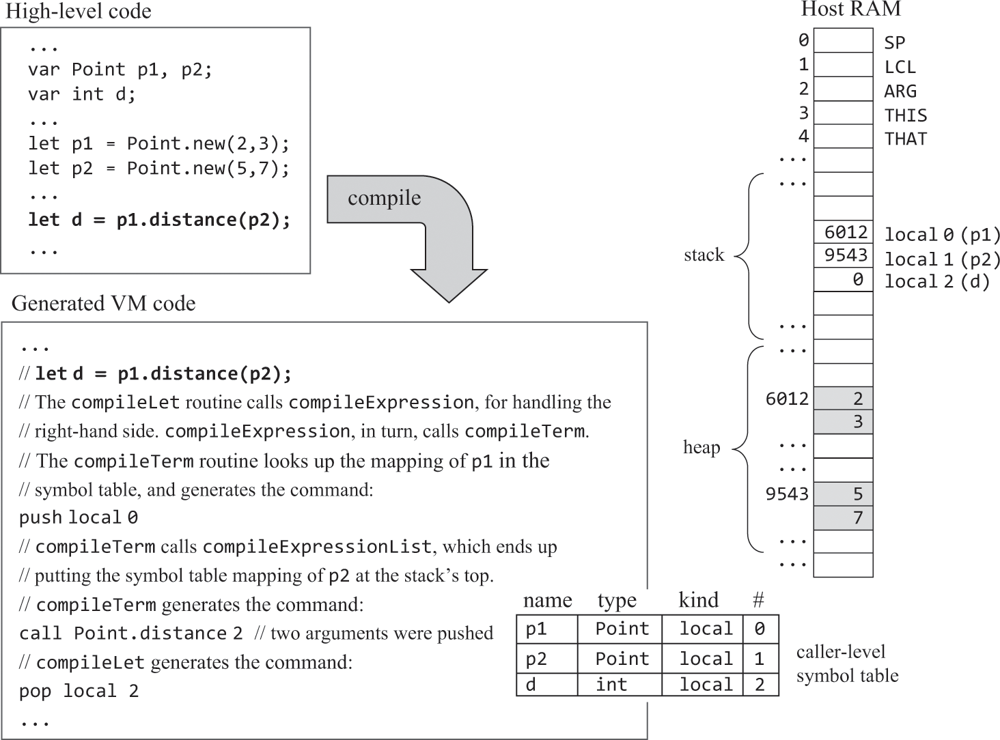
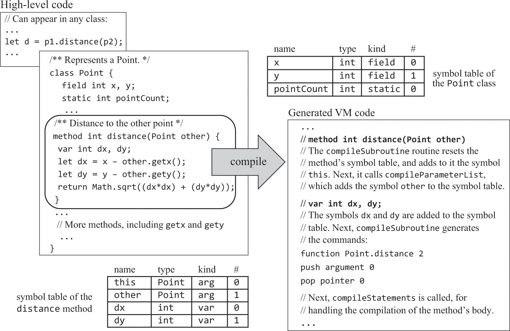
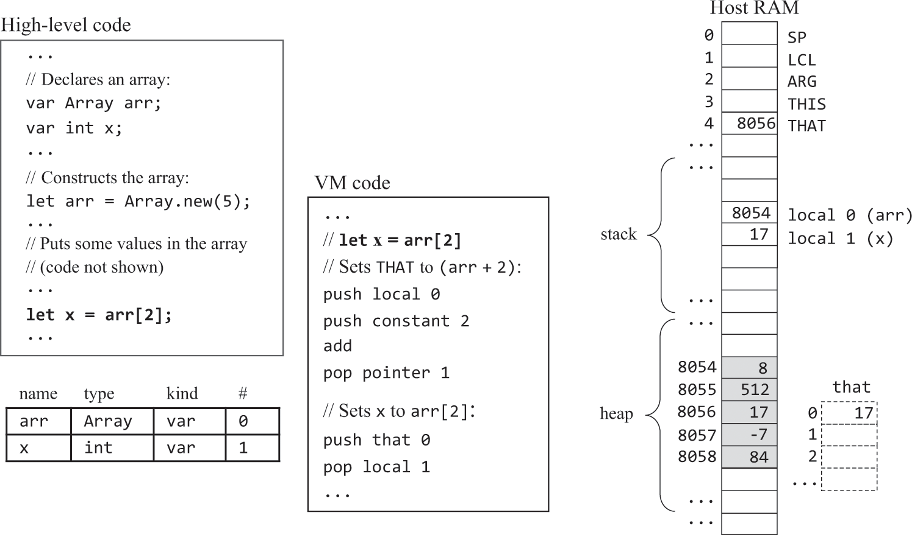
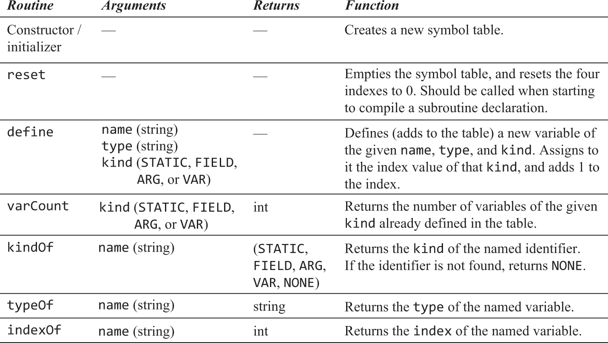
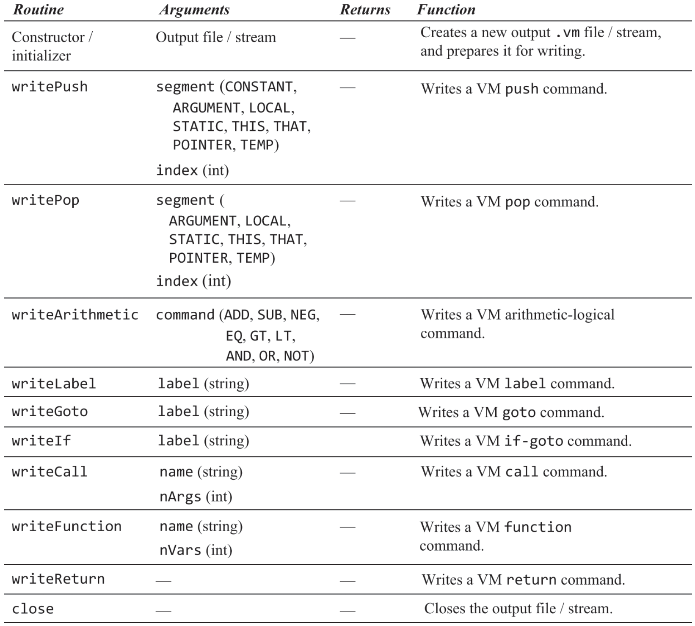

# 11.Jack语言——编译器（代码生成）

### 变量
#### 生命周期
```text
这里无需处理生命周期，已在07和08章的VM翻译器中实现了：
· 静态（类级）：和代码同生死。在汇编中以"@CLASS名.变量名"方式作为汇编变量出现。
· 字段（实例级）：和对象同生死。构造函数为对象开辟空间就是为它所有的字段开辟空间。
· 局部变量（方法级）：和方法同生死。汇编中在实际的函数跳转发生前，由调用者负责为被调用者的局部变量开辟空间，并将LCL修改到正确的位置。
```

#### 符号表
```text
· 就像汇编器用符号表记录vm变量和RAM地址的关系一样，这里也需要用符号表记录Jack变量和VM内存地址的关系。
· 但高级语言中在不同作用域/生命周期（static/field、var）下可存在同名变量，本例使用两个符号表（类级、局部级）分别存储，这两个表分别在每次遇到
“class”、“constructor/method/funciton”时被初始化。method需要初始化一个this条目，在下面叙述。
```


#### 作用域
```text
· 编译器应当先从局部符号表取值，没有的话再检查类级符号表，这被称为“内部作用域隐藏外部作用域”。本例只有这两种作用域级别，对于其他支持无限嵌套
作用域的语言，可以使用链表形式实现符号表（⚠️没明白咋实现）。
```

### 表达式
```text
需要把运算符的中缀表示转为后缀表示（包括函数调用），所以需要修改上一章的CompilationEngine.compileExpression()，使其以后缀方式输出表达式。
```


### 字符串
```text
· Jack标准库封装了String类（标准库在12章中实现，现在只需假定已经存在）用以处理字符串，字符串常量写法是语法糖。这个过程和大多数高级语言的处理
相似，但Jack不提供垃圾回收。
    例如：x = "abc"; 编译器将按如下代码处理。
    1. x = String.new();
    2. x = x.appendChar('a');
    2. x = x.appendChar('b');
    2. x = x.appendChar('c');
```

### 语句
#### return（return x + y;
```text
先翻译x + y，其值自然会出现在栈顶，然后直接生成return即可。
```

#### let（let x = y + 1;
```text
先翻译y + 1，结果位于栈顶，再pop到x在符号表中绑定的vm内存地址。数组处理在下面叙述。
```

#### do（do className.functionName(...)
```text
do调用的方法不一定有返回值，如何知道方法是否有返回值？不能，那就让所有方法都必须有返回值(void返回0)，在do中一定会抛弃返回值：pop temp 0
```

#### if、while
```text
在vm语言中把它们转成用goto、if-goto表达，要先处理条件表达式，好让其值位于栈顶作为跳转判断条件。
* if示例
    …
    条件表达式的boolean值
    (bool取反)
    if-goto 失败标签
    if成立的逻辑
    goto 后续标签
失败标签
    [else的逻辑]
后续标签
    …

* while示例
    …
while开始标签
    条件表达式的boolean值
    (bool取反)
    if-goto 后续标签
    while成立的逻辑
    goto while开始标签
后续标签
    …

* 布尔取反
    书中设计的true/false分别用-1/0表示，在图8.1/图11.6中分别使用了neg/not试图互换true/false，但我觉得错误，因为按照定义(图7.5)，neg只是
将符号互换，而not是按位取反。所以Jack中的"非"不能直接用vm表示，vm中缺乏这样的直接表达。而在将Jack的if/while/~翻译成vm时都需要布尔取反，如果
不修改vm中not的定义，就只能让Jack编译器生成vm代码把-1和0互换：（虽然随书工具的VMEmulator可以将not解释为true/false互换，但我自己做的不可以
呀，而且这不符合vm中not的定义）
    …
    // 布尔值已位于栈顶
    if-goto TO_FALSE
    push constant 1
    neg
    goto NEXT
TO_FALSE
    push constant 0
NEXT
    …
```

### 对象
```text
· 对象被存储在堆中一块儿单独为其开辟的空间上，为对象开辟空间就是为其所有字段开辟空间。因为字段的生死是随对象的，所以不能存在栈上，栈这种结构是
为了方法调用，只存方法运行状态。通过将基址存到this，后续使用"this 索引"引用这些字段。下面描述的数组需要将元素地址存到that，然后通过that 0就可
操作元素本身，这就是为啥要把this、that做成强绑定pointer 0/1，因为这样就可以做成指针，对that 0的访问就等同于*(pointer 1)。
```


#### 访问控制：无
```text
Jack中所有变量/字段全部私有，所有函数/方法全部公有。
```

#### 构造函数
```text
· 和其他方法/函数的区别在于，在正式翻译方法指令前，要先按如下示例开辟空间并将基址赋值this。构造函数末尾必须是
return this（push pointer 0; return;），即将this值返回。（⚠️从书中来看，貌似把对象地址赋给THIS，就叫做“对齐”？）
```


#### 实例方法
````text
· 实例方法的调用有两种：x.method(y)、method(y)。为了方便编译器实现(CompilationEngine.compileSubroutineCall())，Jack规定只有同类
实例方法才能像后者这么用，而它是隐式的this.method(y)。实例方法是被设计用来操作实例数据的，不同对象的实例数据不同。但汇编里可没有某个对象的方法
这种概念，方法只是一堆指令集，只能将调用者作为参数传入方法，而被调用者会将其作为this以引用实例数据。本例设计将this作为第一个参数。
· （⚠️Jack语言不支持继承。在支持继承的语言中，对x.m()等方法调用的处理取决于对象x的类成员关系，这只能在运行时确定。因此，具有继承特性的面向对象
语言的编译器必须将所有方法都视为虚方法，并根据应用该方法的对象的运行时类型来解析它们的类成员关系。由于Jack不支持继承，所以所有的方法调用都可以在编
译时进行静态编译。）
````

```text
· 既然实例方法参数列表的第一个永远是this，那么编译器需要为实例方法的符号表初始化一条记录：<this 类名 arg 0>。
· 真正编译实例方法指令前，应先按如下示例将arg 0赋给this（pointer 0）。
```


### 数组
```text
· 编译器通过Array类实现数组语义，那么数组引用存的是数组在堆中的基址，将数组引用的值与索引相加得到一个内存地址，这个内存地址（存在that指针上）
上的值（通过that 0获得）就是数组元素的值。
```

```text
如果是let arr[x] = y呢？THAT只有一个，它会被重写，上述方式无法工作。采用如下方式实现：
	push arr
	(compileExpression)
	add
	// 目标地址已位于栈顶
	(compileExpression)
	// 源值已位于栈顶，暂存到temp
	pop temp 0
	// 将目标地址移至that
	pop pointer 1
	// 将源值写到RAM[目标地址]上
	push temp 0
	pop that 0
```

<br>
<br>

### 习题（代码位于/JackCompiler
<hr>
<br>
<br>

JackTokenizer（标记化，与10章完全相同

<br>
<br>
<hr>
<br>
<br>

SymbolTable（符号表


<br>
<br>
<hr>
<br>
<br>

VMWriter（代码生成


<br>
<br>
<hr>
<br>
<br>

CompilationEngine（API与10章相同，但这里输出的是vm代码而不是xml