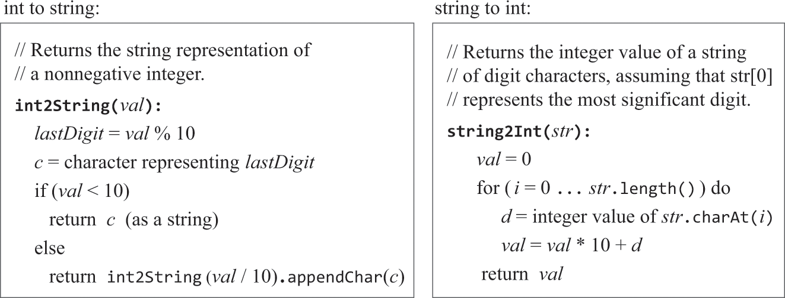
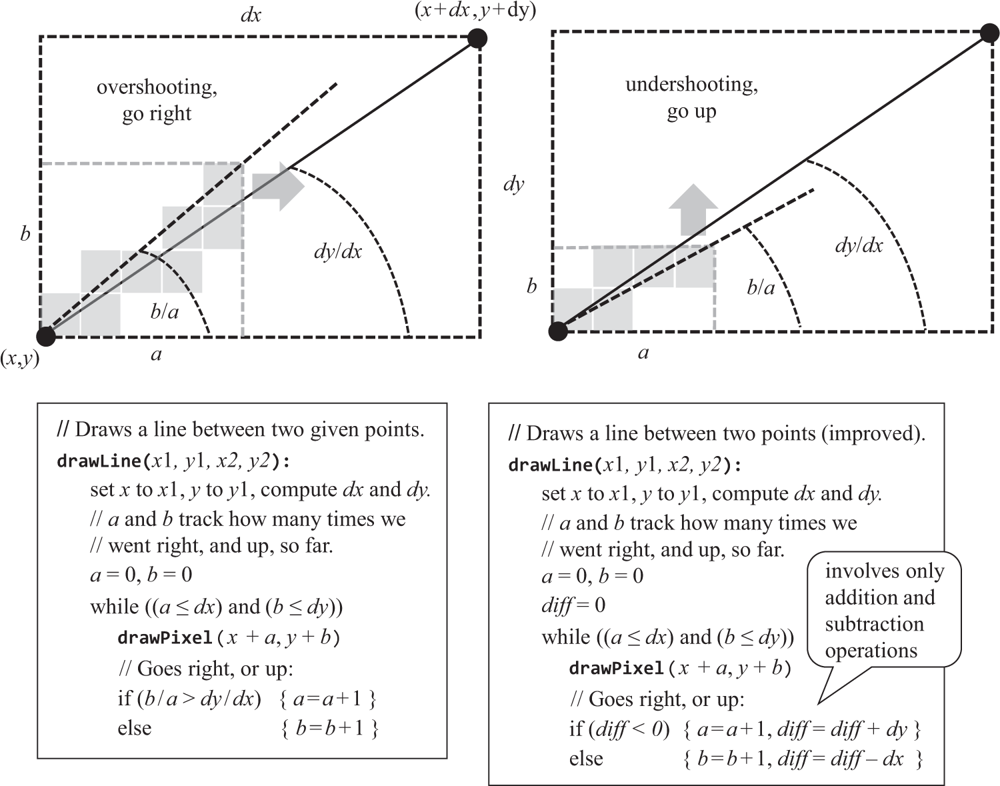
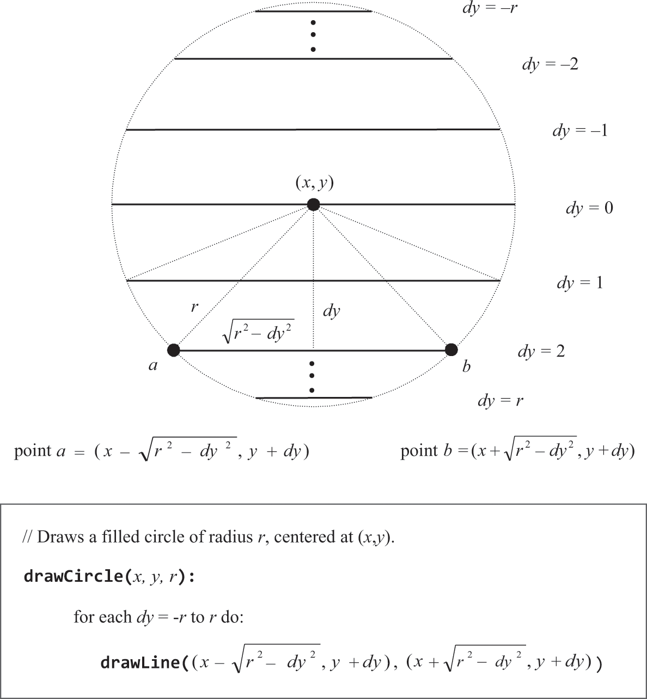

# 12.操作系统（标准库）

⚠️只是大略看了下，没打算做

### 概述
```text
旨在缩小硬件软件差距——也就是提供一套Jack标准库
```

### 数学运算（⚠️没看懂
```text
本例的加法在ALU级实现，并根据补码实现剑法，乘除由标准库提供
```

### 字符串（字符串/整数转换
```text
找一个基准点，比如’0’码点是48，对整数字符x的码点可表示为：x+48
```


### 内存
```text
本例的堆基址初始化为2048。书中介绍使用链表记录可用空间的方式和两个查找可用空间的算法：
    best-fit：返回符合大小的空间中最不浪费的。
    first-fit：返回符合大小的空间中最早被找到的。

class Node {
    int address;
    int size;
    Node next;
}

⚠️实现Memory不能用class抽象和new，因为new是编译器用Memory实现的，编译过后就成递归了。需要想办法用基本类型实现上述抽象，Node本身也需要空间来存储
```

### 屏幕

像素点
```text
将屏幕视为(x行, y列)的像素点，一个像素点对应RAM中的一bit，但RAM只能16bit读写，所以开关某像素点需要经过运算以只改变这16个bit位中的一个。
```

行
```text
像素点是规整的，对于斜线，只是在视觉上欺骗观看者。
```


圆
```text
依赖数学函数计算实现
```


字符
```text
    需要将满屏幕像素分组用来绘制单个字符，绘制方案被称为“字体”，本例用没11行8列区域展示一个字符，要为周边留白防止字符连到一起，“N”示例如下。同时需要
一个行列表示的光标来指示下一个字符的位置，换行、退格等的实现就是通过操纵光标。
```


### 键盘
```text
    只负责从KBD读取数字（无按键值为0），通过字符集可得知是哪个字符，要回显在屏幕上的。Hack不支持中断，进入函数后要一直循环直到中止，至于何时中止
取决于具体函数，比如readInt只读一个有效按键，readLine读到回车为止。
```