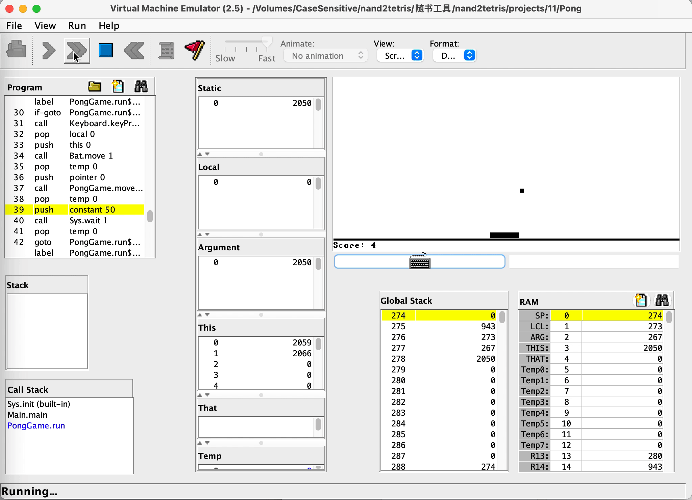

# nand2tetris

```text
《计算机系统要素——从零开始构建现代计算机（第2版）》学习记录

· 博客：https://woieha320r.github.io/《计算机系统要素——从零开始构建现代计算机（第2版）》
· GitHub：https://github.com/woieha320r/nand2tetris
```



### 概述

```text
与非门 -> 与、或、非、抑或 -> 选择器、分解器
      ↓
    半加器 -> 全加器 -> 自增、算术逻辑单元
          ↓ + DFF
        寄存器 -> 随机访问内存、程序计数器
              ↓ + 机器指令设计
         中央控制单元、内存 -> 计算机整体架构
                         ↓ + 任一门语言
                       汇编器
                       
                       汇编
                        ↑ + 任一门语言实现Jack VM翻译器
                  Jack VM中间代码
                        ↑ + Jack标准库 + 任一门语言实现Jack编译器
                        ↑       ↑
                     Jack 源码 -> + 算法
```

### 要点

```text
· 把复杂问题分解为可管理的模块，当使用下一层的模块时，专注于抽象而忽略其实现细节。
· 多位二进制的表达顺序是[n]～[0]，不是[0]~[n]。
· 多注意二进制串的规律。
· HDL语法的=代表线路连接而非赋值。
· HDL语法可以直接置入多位0、1，并且内部节点不能直接使用子总线，需要先输出，下面是个综合的例子，用于判断in中是否含有有效位1。
    // 描述：if in[16] contains 1; then hasTrue=1; fi
    Or16(a=in, b[0..15]=false, out[0..7]=lowIn, out[8..15]=highIn);
    Or8Way(in=lowIn, out=lowHasTrue);
    Or8Way(in=highIn, out=highHasTrue);
    Or(a=lowHasTrue, b=highHasTrue, out=out);
    // 当有两个地方同时需要结果值时，可以被指定多次：Or(a=true, b=false, out=waitOtherOpt, out=out);
```
